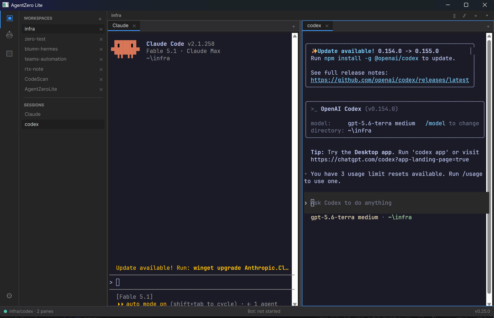

# AgentZero Lite — Avalonia host (Windows + macOS)

> 🇰🇷 한국어: [README-Avalonia-KR.md](README-Avalonia-KR.md) · Main manual: [README.md](README.md) · Design record: [Docs/avalonia-v2/DESIGN.md](Docs/avalonia-v2/DESIGN.md)



AgentZero Lite ships **two GUI hosts over one shared core**:

| | WPF host (`Project/AgentZeroWpf`) | Avalonia host (`Project/AgentZeroAvalonia`) |
|---|---|---|
| Runs on | Windows | Windows **and macOS** (arm64 `.app`) |
| Role | **Windows-first lab** — every feature is built and tried here first | **Multi-OS edition** — takes in what proved its worth |
| Terminal | xterm.js in WebView2 + ConPTY | xterm.js in `NativeWebView` + ConPTY (Windows) / Porta.Pty (macOS) |
| Shared | `Project/ZeroCommon`: actors, agent loop, tool catalog, stores, SQLite, CLI JSON contract | same |

## The strategy: WPF first, then converge

WPF is not being replaced. It is the fastest place to try things on Windows — the UI stack is mature, the
tooling is quick, and most of the team's day is spent there. Ideas land in WPF, get used, and the ones that
earn their keep are **converted** into the Avalonia host so they reach macOS too. The conversion itself is a
skill worth keeping sharp: every feature that goes through it comes out with its logic in `ZeroCommon` and its
UI thin, which makes the next conversion cheaper.

Rules that keep the two hosts honest:

1. **Anything without a UI dependency lives in `ZeroCommon`.** If a WPF feature cannot be converted without
   copying logic, the logic was in the wrong place; move it down first.
2. **Both hosts read and write the same data** — the SQLite file, the settings JSON files, the alias registry,
   the terminal split layout. A workspace arranged in one host opens identically in the other.
3. **The CLI is one contract.** `AgentZeroLite -cli …` sends and receives the same JSON in both hosts; only the
   transport differs (WM_COPYDATA on WPF, a named pipe on Avalonia). `-cli help agentzero` applies to both.
4. **Converting a feature never edits the WPF project.** The regression gate is `git diff --stat main -- Project/AgentZeroWpf`
   being empty for the conversion commits. Shared fixes go into `ZeroCommon` and benefit both.
5. **Windows-only pieces stay Windows-only, fenced by `OperatingSystem.IsWindows()`** (local LLM via LLamaSharp,
   DPAPI, BLE, OS automation). macOS gets the External-provider path and AES-GCM secrets instead.

## Stack

| Layer | Package / component | Version | Notes |
|---|---|---|---|
| Runtime | .NET | 10.0 (`net10.0`) | plain TFM — no `-windows` suffix on the Avalonia host or ZeroCommon |
| UI | Avalonia · Avalonia.Desktop · Avalonia.Themes.Fluent · Avalonia.Fonts.Inter | 12.1.2 | MIT |
| Web view | Avalonia.Controls.WebView (`NativeWebView`) | 12.1.0 | WebView2 on Windows, WKWebView on macOS |
| MVVM | CommunityToolkit.Mvvm | 8.4.0 | `ObservableObject`, `[RelayCommand]` |
| Terminal renderer | xterm.js (+ fit, web-links, webgl add-ons) | 5.5.0 (vendored) | shared with the WPF host from `Project/AgentZeroWpf/Wasm/xterm/vendor` |
| PTY (Windows) | ConPTY via kernel32 P/Invoke (`ConPtyHost`) | Windows 10 1809+ | no native DLLs shipped |
| PTY (macOS / Linux) | Porta.Pty | 2.2.2 | forkpty shim, natives bundled |
| Actors | Akka · Akka.Streams · Akka.DependencyInjection | 1.5.67 | same topology as the WPF host |
| Persistence | Microsoft.EntityFrameworkCore.Sqlite · SQLitePCLRaw.bundle_e_sqlite3 | 10.0.0-preview.3 · 3.0.3 | one DB file for both hosts |
| Secrets | System.Security.Cryptography.ProtectedData (DPAPI, Windows) · AES-GCM file key (elsewhere) | 10.0.0 | `SecretProtection.Protector` |
| Local LLM (Windows only) | LLamaSharp | 0.26.0 | External providers (OpenAI-compatible REST) on every OS |
| Fonts | JetBrains Mono | OFL 1.1 | vendored with the xterm bundle |

## Build, run, test

```bash
dotnet build Project/AgentZeroAvalonia/AgentZeroAvalonia.csproj -c Debug                 # Windows
dotnet build Project/AgentZeroAvalonia/AgentZeroAvalonia.csproj -c Release -r osx-arm64  # macOS cross-compile
dotnet test  Project/AgentZeroAvalonia.Tests/AgentZeroAvalonia.Tests.csproj             # headless, both OSes

Project/AgentZeroAvalonia/bin/Debug/net10.0/AgentZeroLite.exe                            # GUI
Project/AgentZeroAvalonia/bin/Debug/net10.0/AgentZeroLite.exe -cli status                # drive it from a shell
Project/AgentZeroAvalonia/bin/Debug/net10.0/AgentZeroLite.exe -cli selftest all          # ipc · secrets · pty, no display needed
```

Rider/VS: open `AgentZeroLite.slnx`, pick the run profile **AgentZeroLite (Avalonia GUI)**. The WPF and Avalonia
GUIs share one single-instance mutex on Windows, so close one before starting the other.

macOS: download `AgentZeroLite-Avalonia-v<ver>-osx-arm64.zip` from the *Avalonia host* workflow run, then
`xattr -dr com.apple.quarantine AgentZeroLite.app` (the bundle is ad-hoc signed) and open it. The CLI wrapper is
`AgentZeroLite.app/Contents/MacOS/AgentZeroLite.sh`. Hand checklist: [Docs/avalonia-v2/macos-smoke.md](Docs/avalonia-v2/macos-smoke.md).

## Converted so far

| Area | Status | Notes |
|---|---|---|
| Shell: activity bar, workspace sidebar, status bar, bot pane | ✅ | `MainWindow`, `MainWindowViewModel` |
| Workspaces + terminal tabs, persisted in the shared DB | ✅ | same `CliGroups/CliTabs` rows as WPF |
| Terminal: xterm.js renderer, appearance, IME, links, health banner | ✅ | ConPTY copy on Windows, Porta.Pty on macOS |
| Split panes (right/down, close, move tab, focus by direction), layout restore | ✅ | `WorkspaceLayout<T>`; `CliGroup.LayoutJson` byte-identical to WPF |
| Hotkeys, incl. while the renderer has focus | ✅ | one table; Ctrl→Cmd on macOS |
| AgentBot: CHT / KEY / AI modes, progress + tool cards, handshake | ✅ | same actor topology (`/user/stage/bot/loop`) |
| AgentBot UX: approval toast + auto-approve, URL bubbles, session header, clipboard attachment, key chords, selectable text | ✅ | `AgentEventStream` per active terminal; rules shared in `ZeroCommon/Agents` |
| AgentBot as a docked pane **and** a floating window (Ctrl+Shift+`) | ✅ | one view model, two views; docked along the **bottom** as in WPF (280px, splitter, maximize keeps a 90px sliver of terminal), spanning everything but the activity bar. A sibling row, never an overlay — an Avalonia surface drawn over the terminal's native web view is invisible on macOS. WPF's other bottom tabs (OUTPUT/LOG/NOTE) are not converted, so there is no tab strip |
| Tool belt: terminals, files, `find_files/open_file/stop_media`, web (headless) | ✅ | `WorkspaceToolHost` |
| Settings: External LLM (+ test), CLI definitions CRUD, terminal appearance (live) | ✅ | Local LLM section on Windows only |
| Settings: agent CLI install (Claude, Codex) | ✅ Avalonia only | A built-in row is a shell plus an agent command, so it stays valid while the agent was never installed — the tab then prints "claude : The term 'claude' is not recognized", which reads as a broken app. Selecting such a definition shows whether the tool is on PATH and offers to fetch it: **winget** on Windows (`Anthropic.ClaudeCode` / `OpenAI.Codex`), **npm -g** elsewhere (`@anthropic-ai/claude-code` / `@openai/codex`). Rules and packages live in `ZeroCommon/Services/AgentCliTools` so WPF can adopt the panel without a second copy |
| Settings: AI-mode tool-chain turn budget | ✅ (also back-ported to WPF) | `AgentLoopMaxTurns` (default 12, clamped 1–200) → `AgentLoopOptions.MaxIterations`. Both hosts passed only the per-turn token cap and the temperature, leaving the budget a constant, so a long job could only end in "max iterations (12) reached without 'done'". Built here, then applied to WPF's `AgentBotWindow` + *AIMODE Turns* in its LLM tab, so the shared settings file means one number for both |
| CLI: status, terminal-list/send/key/read/wait/alias (`--alias`), layout, bot-chat, bot-ask, web, selftest | ✅ | pipe `AgentZeroLite.cli`; `.ps1` / `.sh` wrappers |
| Remote shell (SSH) definitions: composed `ssh` launch + stored-password autofill | ✅ Windows / ⏳ macOS | composition moved into `TerminalLaunchPlanner` (WPF composes at its own call sites, unchanged); autofill is `ZeroCommon/Services/SshPasswordWatcher`. The password column is shared with WPF, so this host seals it with `Security/SshPasswordVault` (same DPAPI entropy, no marker). On macOS remote definitions stay hidden — `ComposeArguments` only knows cmd/PowerShell wrappers |
| CI: windows-latest + macos-14, win-x64 zip, `.app` bundle | ✅ | `.github/workflows/avalonia-build.yml` |
| AgentBot skills: SkillSync, starter-pack import, `.agent-zero/` cache, slash autocomplete | ⏳ not yet | one dependency chain — the slash list is empty without SkillSync, which drives the Claude CLI through a Windows-only shell probe |
| AgentBot voice (mic, VAD, STT, TTS, mute, delegation) | ⏳ not yet | needs the audio capture layer in ZeroCommon first; NAudio/WASAPI is Windows-only |
| Browser page (tabbed WebView), OS control, Voice, Vision, Music, Remote, Wearable BLE, Note/Document viewers, Scrap, WebDev plugins | ⏳ not yet | second phase; web tools run headless meanwhile |
| Local LLM on macOS (Metal) | ⏳ investigate | External providers only for now |
| Installer, Developer ID signing / notarization | ⏳ | procedure in `harness/knowledge/_shared/code-signing.md` |

## Conversion playbook — what we learned

**Sequence that worked.** Seams first (`ZeroCommon`, headless-tested), then the host skeleton, then the terminal
(the hardest and most valuable piece), then the things that sit on it. Each milestone kept the WPF build green and
ended with a CLI-driven smoke, so a regression showed up the same day.

**Read the WPF code-behind as a spec, not as source to port.** The WPF views are large code-behind files with no
view models. The port is a view model that exposes the same behaviour plus a thin view; the WPF file tells you
what the behaviour is. Copy verbatim only where the behaviour *is* the value (ConPTY host, handshake text, key
alias table, CLI JSON shapes).

**Tips, by topic**

- *Web view.* `NativeWebView` cannot map a folder to a virtual host and cannot synthesize responses in
  `WebResourceRequested`; serve assets from a loopback `TcpListener` with a random token path (`LocalAssetServer`).
  JS→C# is `window.invokeCSharpAction(string)`; C#→JS is `InvokeScript`. Send output as base64 batches
  (`out64`) so VT bytes never need escaping, and **one script per batch** so a repaint is never painted half-way.
- *Native controls and z-order.* The WebView is a native child; nothing Avalonia draws appears over it on macOS.
  Put banners *above* the renderer, menus in popups. Never re-parent a `NativeWebView`: keep every terminal on one
  `Canvas` and position it over its pane slot (`TerminalsView`).
- *ConPTY facts the WPF host never hit.* A parent whose stdio is a pipe (test runner, `-cli`) hands its standard
  handles to a console child even with `bInheritHandles=false` — blank them around `CreateProcess`. Pipe EOF is not
  the exit signal — wait on the process handle. ConPTY on current Windows does not pass DEC 2026 (synchronized
  output) through, so gather output for a frame (~12 ms) before sending it to the renderer.
- *Renderer input is not keyboard input.* xterm.js answers the program's terminal queries (device attributes,
  cursor position) on the same `in` channel as keystrokes. Feeding that to the health tracker flashes the "wedged"
  banner on every TUI repaint. Only CLI/bot writes count as input attempts.
- *Avalonia XAML.* Compiled bindings check paths at build time — a binding that is wrong fails the build, use it.
  A `Button.Flyout` opens *before* `Click` fires, so build menus up front, not in the click handler. Don't put
  `DataContext=` and `IsVisible=` on the same element (`IsVisible` resolves against the new context); wrap it.
  A named element inside a `Flyout` is not a generated field; reach it through the owner.
- *Threading.* Akka's synchronized dispatcher captures `SynchronizationContext.Current` at `Initialize()`;
  install `AvaloniaSynchronizationContext` explicitly if it is null. PTY callbacks arrive on background threads —
  `Dispatcher.UIThread.Post` everything that touches a control. The CLI server awaits
  `Dispatcher.UIThread.InvokeAsync(Func<Task<string>>)` so slow verbs (`web`) never block the accept loop.
- *Persistence and secrets.* Reuse the WPF stores untouched; only add an OS-aware protector
  (`SecretProtection.Protector` = DPAPI on Windows, AES-GCM file key elsewhere) and an `AppPaths` root.
- *Tests.* xUnit `Assert.DoesNotContain(string, string)` uses culture comparison and treats ESC as ignorable —
  check `text.Contains((char)27)` instead. Timing-based tests must poll, not sleep a fixed time; CI runners are slow.
  Fixtures that assert `C:\` paths must be OS-aware or excluded on macOS.
- *macOS specifics seen in CI.* A child that exits within milliseconds (`sh -c echo`) can be gone before the
  reader attaches and its output is lost; real shells are long-lived, but a self-test child must linger.
  `sh` scripts need the executable bit set in git (`git update-index --chmod=+x`).

**Where things are**

- Design + per-milestone findings: `Docs/avalonia-v2/DESIGN.md` · missions `harness/missions/M0033…M0040` · records
  `harness/logs/mission-records/M003x-수행결과.md`
- Host sources: `Project/AgentZeroAvalonia/{Terminal,Layout,ViewModels,Views,Services,Cli,macos}`
- Shared seams added for the port: `Project/ZeroCommon/Platform/*`, `Services/{IPtyHost,XtermTerminalSession,TerminalHealthTracker,TerminalLaunchPlanner}.cs`,
  `Module/TerminalCatalogJson.cs`, `Security/AesGcmFileSecretProtector.cs`, `Llm/Tools/GemmaNativeToolCall.cs`
