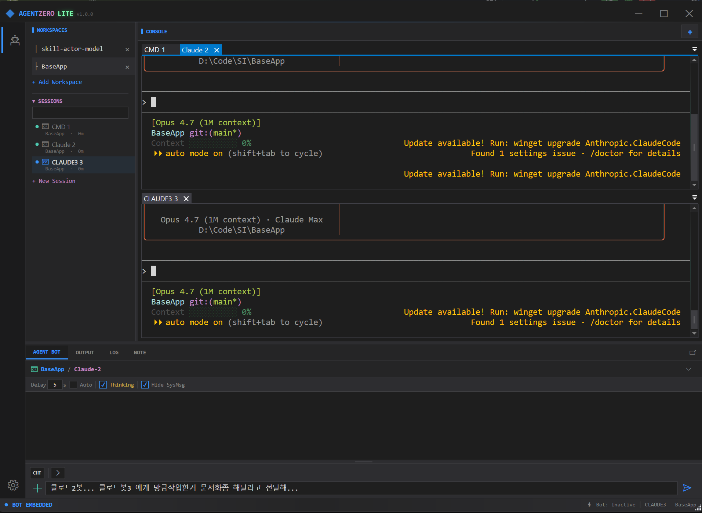

# AgentZero Lite

**AI 시대를 위한 미니멀 IDE — 여러 개의 CLI를 한 화면에서 나란히 다루세요.**

> 영문 원본: [README.md](README.md)

---

## ⚠️ 이 소스를 보고 있는 개발자께

이 소스를 보고 있다면 당신은 개발자입니다. AgentZero Lite는 **보안을 우선 고려하는 CLI 보조툴**입니다.

- **모델을 다운로드하는 기능은 있지만**, 외부 인터넷으로 사용자의 데이터를 전송하지는 않습니다.
- 배포 조작을 방지하기 위해 **깃허브 액션을 통해서만 투명하게 빌드**되며, 다른 릴리스 경로는 두지 않았습니다.
- 위험성이 있는 **자동 업데이트도 제공하지 않습니다.**

**이것이 사실인지 아닌지?** 직접 검증해 위험성을 발견한다면 **언제든 깃허브 이슈에 올려주세요.** 보안 경고가 뜨는 조치 대상 하위 모듈도 빠르게 대응하도록 AI 개선 루프에 걸어두었으나 완벽하지는 않습니다. **보안 강화 기여는 언제든 환영입니다.**

---




🎬 **시연 영상** — Claude 와 Codex 동시 제어 데모:

<a href="https://www.youtube.com/watch?v=kXQjohrpA8o"></a>

같은 워크스페이스에서든 다른 워크스페이스에서든, CLI로 돌아가는 AI(Claude,
Codex, 종류 무관)에게 명령 하나를 바로 꽂아 넣을 수 있습니다. 서로 다른 모델의
AI들을 동시에 띄워두고, 같은 경로로 둘을 대화시킬 수도 있습니다 — 별도 중계
서버나 커스텀 브로커 없이, 모델 간 크로스 대화.

AgentZero Lite는 단순한 아이디어로 만들어진 Windows 데스크톱 셸입니다. AI 시대에
하루의 대부분은 *커맨드라인 도구와 대화하는 시간*입니다. `claude`, `codex`, `gh`,
`docker`, `pwsh`, REPL, 빌드 로그 tail — 각각 자기만의 터미널을 원하고, 사용자는
이 모두를 창을 옮기지 않고 동시에 보고 싶습니다. AgentZero Lite는 진짜 멀티탭·
멀티워크스페이스 ConPTY 터미널과, 포커스된 터미널로 텍스트·스킬 매크로를 전달하는
작은 채팅 창을 제공합니다. 그 이상도 이하도 아닙니다.

---

## 주요 기능

- **멀티탭 ConPTY 터미널** — 각 탭이 진짜 `conhost` 렌더러로 돌아갑니다(의사
  PTY 흉내가 아님). `EasyWindowsTerminalControl` / `CI.Microsoft.Terminal.Wpf`
  기반.
- **워크스페이스** — 탭을 폴더 단위로 묶어 프로젝트마다 별도 CLI 세트를 유지합니다.
  워크스페이스 버튼 한 번으로 `cd` 컨텍스트와 새 Claude가 함께 뜹니다.
- **AgentChatBot** (v0.9.1 부터 UI 라벨은 **AgentCLI**) — 도킹 가능한 채팅 패널.
  입력한 텍스트를 **현재 활성 터미널**로 전달합니다. `CHT` 모드는 텍스트를,
  `KEY` 모드는 순수 키스트로크(Ctrl+C, 화살표, Tab 등)를 보냅니다. AI가 아니라
  **입력 브로커**입니다. *리브랜드는 UI 표면만 — 내부 액터 경로
  `/user/stage/bot` 과 `AgentBotActor` 클래스명은 그대로라 외부 스크립트와
  스킬 매크로는 그대로 동작합니다.*
- **AI ↔ AI 대화 (핵심 기능)** — `AgentZeroLite.ps1`을 Claude 탭이나 Codex 탭에
  **딱 한 번 가르치면** 그 뒤로 한쪽 AI가 다른 터미널을 *이름으로 불러* 대화를
  시작할 수 있습니다. 탭 0의 Claude가 탭 1의 Codex에게 말을 걸고, Codex가
  답장을 보내고, 각자 `terminal-read`로 상대 출력을 읽습니다. 중간 브로커도, 클라우드
  중계도 없이, AgentZero의 IPC만 거칩니다. Lite 에디션이 존재하는 이유인, 모델들
  사이의 티키타카입니다.
- **AIMODE — 인-셸 코디네이터로서의 온디바이스 LocalLLM** — Shift+Tab으로
  AgentBot을 AI 모드로 전환하면, 작은 온디바이스 LLM(현재 Gemma 4, Nemotron
  준비 중)이 *다른* AI CLI들을 사용자 대신 구동하는 비서가 됩니다. 한국어든
  영어든 모호하게 부탁하면 LocalLLM이 적절한 터미널 AI를 골라 메시지를 보내고,
  기다리고, 응답을 읽고, 한 줄로 요약해서 가져옵니다. 양방향 채널: peer 터미널은
  기존 `bot-chat` CLI로 직접 회신할 수 있어 LocalLLM이 폴링만 하지 않아도
  됩니다. 어떤 것도 기기를 떠나지 않습니다. 자세한 내용은
  [AIMODE 섹션](#-aimode--인-셸-코디네이터로서의-locallm) 참조.
- **🎙 음성 — 핸즈프리로 AgentBot 구동, 옆 탭은 키보드 작업** —
  마이크에 말하면 AgentBot이 오프라인으로 받아쓴 뒤(Whisper.net, GGML
  small/medium 모델 로컬 캐시) 그 텍스트를 활성 터미널 AI에 그대로 타이핑해
  보냅니다. 핵심은 **듀얼 멀티태스킹**: 한 탭은 손가락으로(코드 작성, Claude
  diff 검토), *다른* 탭은 음성으로 동시 진행. 두 개의 AI 대화가 병렬로
  돌아가고, 사람 한 명이 둘 다 감독합니다 — AIMODE의 모델 간 티키타카가
  이젠 **사용자 본인의 두 입력 채널 간 티키타카**로 확장됩니다. 백엔드는
  **CPU + Vulkan** 동시 번들이라 AMD / Intel / NVIDIA 모두 같은 바이너리로
  가속됩니다. 멀티 GPU 시스템은 자동 베스트 픽 휴리스틱 + 음성 설정탭의
  수동 오버라이드로 대응. **음성 출력(TTS 응답)은 개발 중** — SAPI / OpenAI
  TTS 설정 배관은 들어와 있지만 응답 스트리밍 파이프라인은 아직 미완이라,
  지금 단계에선 입력 전용입니다.
- **AgentBot `[+]` 메뉴 — 터미널 AI를 무장시키는 세 가지 방법** —
  - **`AgentZeroCLI Helper`** — 채팅 입력창에 AgentZero Lite CLI 사용법 브리핑을
    바로 넣어줍니다. 검토 후 Send 를 누르면 현재 활성 터미널의 AI(Claude, Codex, 셸
    탑재 모델 무관)가 1회 학습 — 스킬 설치 없이 즉석에서 `AgentZeroLite.exe -cli`
    사용법을 알게 됩니다. CLI가 PATH에 없으면 *Settings → Register PATH* 후 재시작
    안내 메시지를 띄웁니다.
  - **`Import Starter Skills`** — 함께 배포되는 `agent-zero-lite` 스킬을 현재
    워크스페이스의 `.claude/skills/` 로 복사합니다. 다음 Claude Code 세션부터
    영구적으로 스킬이 인식됩니다.
  - **`Skill Sync`** — Claude가 이미 탭에서 돌아가는 상태에서 `/skills` 화면을 읽어
    채팅창의 `/` 슬래시 메뉴로 변환합니다. `/` → 스킬 선택 → Enter 로 매크로 텍스트가
    터미널로 바로 발사됩니다. LLM 라운드트립 없음.
- **🔎 Scrap — 윈도우 스파이 + 스크롤 인식 텍스트 캡처 (v0.9.1)** —
  ActivityBar 의 새 Scrap 아이콘에서 크로스헤어를 드래그해 아무 보이는 창에
  떨어뜨리면 (또는 HWND 직접 입력) 그 창의 *읽을 수 있는 텍스트* 전체를
  자동 스크롤하며 잡아옵니다. 캡처 전략 4단계: UIA `TextPattern` → 포커스
  영역 UIA 스크롤 → **클립보드 스크롤** (Ctrl+Home → Ctrl+A/C + PageDown
  루프, IntelliJ / Chrome / VSCode 등 Ctrl+A 지원하는 *모든* 앱에서 동작) →
  `WM_VSCROLL` 폴백. 각 캡처는 `logs/scrap/yyyy-MM-dd-HH-mm-ss-scrap.txt`
  파일로 저장되며 스크롤 진행 중 프리뷰 패널이 *라이브로* 채워집니다.
  캡처 종료 시 원본 클립보드 복원.
- **Note 패널** — 마크다운/Mermaid 다이어그램/Pencil 파일을 렌더링하는 보조
  패널. 현재 워크스페이스 폴더 범위로 동작합니다.
- **CLI 원격 제어** — `AgentZeroLite.exe -cli terminal-send 0 0 "npm test"`를
  스크립트 어디서든 실행해 GUI를 `WM_COPYDATA` + 메모리 맵 파일로 제어합니다.
- **액터 모델 (Akka.NET)** — 터미널 생명주기, 워크스페이스 라우팅, 채팅 입력을
  감독받는 액터로 처리합니다. 한 세션이 죽어도 창 전체가 내려가지 않습니다.
- **실행 파일 하나, 프로세스 하나** — 단일 인스턴스 가드, 설정은 SQLite, .NET 10
  런타임 외 의존성 없음. 빌드 크기 ~60 MB.

---

## 메탈 모델

```
+--------------------------------------------------------------------------+
| AgentZero                                                    -  □  ×    |
+---+------------+-----------------------------------------------+--------+
|   | WORKSPACES | [Claude1] [pwsh1] [build-log] [+]            |        |
| ⚙ | ▸ monorepo +-----------------------------------------------+        |
| 🤖 |   ▸ web    |                                              |        |
|   |   ▸ api    |           ConPTY 터미널 (활성 탭)              |        |
|   | ▸ blog     |                                              |        |
|   |            |                                              |        |
|   | SESSIONS   +-----------------------------------------------+        |
|   |  · Claude1 | AGENT BOT ▾ | OUTPUT | LOG | NOTE                    |
|   |  · pwsh1   +-----------------------------------------------+        |
|   |            |  > /skills                                    |        |
|   |            |  [스킬 목록]                                    |        |
|   |            |  > 테스트 돌리고 요약해줘                    [Send]  |
+---+------------+-----------------------------------------------+--------+
```

상단: 탭마다 ConPTY 터미널. 좌측: 액티비티 바 + 워크스페이스/세션 사이드바.
하단: 탭 전환형 패널 — AGENT BOT(활성 터미널로 텍스트/키 전송), OUTPUT, LOG,
NOTE(워크스페이스별 마크다운 뷰어).

---

## 아키텍처

```
┌─ AgentZeroWpf (WinExe, WPF, net10.0-windows) ───────────────────────────┐
│                                                                         │
│  MainWindow  ──── N개 ConPTY 탭 호스팅  ──── AgentBotWindow (dock/float)│
│      │                                              │                   │
│      │  WM_COPYDATA + MMF  <─  CliHandler.cs  ──>   │                   │
│      │  (외부 스크립트가 GUI를 구동)                  │                   │
│      ▼                                              ▼                   │
│  ActorSystemManager (Akka.NET)                                          │
└──────────────────────┬──────────────────────────────────────────────────┘
                       │  ProjectReference
┌─ ZeroCommon (ClassLib, net10.0) ────────────────────────────────────────┐
│  Actors/    Stage → Workspace(N) → Terminal(N)  + AgentBot (1)          │
│  Services/  ITerminalSession, AgentEventStream, AppLogger               │
│  Data/      AppDbContext + EF Core (SQLite)                             │
│             CliDefinition / CliGroup / CliTab / ClipboardEntry          │
│  Module/    CliTerminalIpcHelper, CliWorkspacePersistence, ...          │
└─────────────────────────────────────────────────────────────────────────┘
```

`ZeroCommon`은 UI 의존성이 없는 라이브러리로, 자체 헤드리스 테스트 프로젝트
(`ZeroCommon.Tests`, xUnit + Akka.TestKit)가 커버합니다. `AgentTest`는 WPF에
의존하는 영역을 담당합니다.

### 액터 토폴로지

```
/user/stage                  — 최상위 감독자, 1개 인스턴스
    /bot                     — AgentBotActor: UI 게이트웨이 (모드 Chat/Key,
                               UI 콜백, peer 라우팅). 자식 AgentLoop을 lazy로 생성.
        /loop                — AgentLoopActor: 본 에이전트. IAgentLoop 한 개를
                               보유, Idle→Thinking→Generating→Acting→Done FSM 구동.
    /ws-<workspace>          — WorkspaceActor: 해당 폴더의 터미널 소유
        /term-<id>           — TerminalActor: ITerminalSession 래핑
```

모든 메시지는 `ZeroCommon/Actors/Messages.cs` 한 곳에 정의돼 있습니다.
Agent 어휘 표준 표 — `harness/knowledge/_shared/agent-architecture.md`.

---

## 프로젝트 구성

| 프로젝트              | 경로                          | 종류                          | 네임스페이스          |
|----------------------|-------------------------------|-------------------------------|----------------------|
| **AgentZeroWpf**     | `Project/AgentZeroWpf/`       | WinExe (net10.0-windows, WPF) | `AgentZeroWpf.*`     |
| **ZeroCommon**       | `Project/ZeroCommon/`         | ClassLib (net10.0, UI 없음)   | `Agent.Common.*`     |
| **AgentTest**        | `Project/AgentTest/`          | xUnit (net10.0-windows)       | `AgentTest.*`        |
| **ZeroCommon.Tests** | `Project/ZeroCommon.Tests/`   | xUnit (net10.0, 헤드리스)     | `ZeroCommon.Tests.*` |

참조 관계: `AgentTest → AgentZeroWpf → ZeroCommon ← ZeroCommon.Tests`. WPF / Win32
의존성이 없는 코드는 전부 ZeroCommon에 있어야 합니다.

---

## 빌드 & 실행

요구사항: Windows 10/11, [.NET 10 SDK](https://dotnet.microsoft.com/), `dotnet`을
실행할 수 있는 터미널. Rider나 Visual Studio 2022 17.11+에서 작업 가능 —
아래 IDE 주의사항을 꼭 읽어주세요.

```bash
# 복원 + WPF 앱 빌드 (ZeroCommon은 프로젝트 참조로 자동 빌드)
dotnet build Project/AgentZeroWpf/AgentZeroWpf.csproj -c Debug

# Release 빌드 (CLI 래퍼 스크립트 쓰기 전에 필요)
dotnet build Project/AgentZeroWpf/AgentZeroWpf.csproj -c Release

# GUI 실행
Project/AgentZeroWpf/bin/Debug/net10.0-windows/AgentZeroLite.exe

# 헤드리스 테스트 (공용 로직)
dotnet test Project/ZeroCommon.Tests/ZeroCommon.Tests.csproj

# WPF 의존 테스트 (액터, 터미널 세션, 승인 파서)
dotnet test Project/AgentTest/AgentTest.csproj
```

### ⚠️ IDE 주의사항 — 디버깅 시 Terminal Mode OFF

AgentZero는 WPF 내부에 자기만의 ConPTY 터미널을 호스팅합니다. IDE가 프로세스의
stdin/stdout/stderr에 자기 터미널을 붙이면(Rider 기본값, VS의 "Redirect standard
output", VS Code 내장 터미널로 직접 실행) **ConPTY가 소유해야 할 콘솔 이벤트를
IDE가 가로챕니다**. 탭이 시작되지 않거나 깨진 출력이 보입니다.

**Run / Debug 누르기 전에 IDE의 터미널 붙이기를 반드시 끄세요:**

| IDE            | 설정                                                                      |
|----------------|---------------------------------------------------------------------------|
| **Rider**      | Run / Debug configuration → **Use external console = ON** (`USE_EXTERNAL_CONSOLE=1` in `.run.xml`) |
| **Visual Studio** | 프로젝트 속성 → 디버그 → **"Use the standard console" / "Redirect standard output" 체크 해제** |
| **VS Code**    | `launch.json`에서 `"console": "externalTerminal"` 설정 (`"internalConsole"` 금지) |

요약 — 자식 프로세스에게 진짜 콘솔 창을 주세요. 일반 셸에서 `dotnet run`으로
실행하는 경우는 문제없습니다(IDE가 stdio를 가로채지 않음).

---

## 두 AI CLI가 서로 대화하게 만들기

Lite 에디션의 대표 유스케이스이며 1분이면 세팅됩니다.

1. **CLI 경로 등록 (1회).** Settings → *AgentZero CLI* → `Register PATH`.
   이제 어느 셸에서든 `AgentZeroLite.ps1`이 잡힙니다.
2. **같은 워크스페이스에 AI 탭을 2개 띄웁니다.** 예를 들어 그룹 0 탭 0 = `claude`,
   그룹 0 탭 1 = `codex` (자연어 지시를 받는 AI CLI면 어느 것이든).
3. **각 AI에게 이 도구를 가르칩니다.** 탭마다 아래 한 줄을 붙여넣으세요:
   > `AgentZeroLite.ps1 help`를 학습하고, 터미널 간 대화에 이 도구를 사용해.
   > `terminal-list`로 탭 목록을 보고, `terminal-send <grp> <tab> "텍스트"`로
   > 다른 AI 탭에 이름으로 말을 걸고, `terminal-read <grp> <tab> --last 2000`으로
   > 상대 답변을 읽어.
4. **대화를 시작합니다.** Claude 탭에서 이렇게 말하세요:
   *"Codex라는 이름의 탭에 인사하고, REST 엔드포인트를 함께 설계하자고 제안해."*
   Claude는 `AgentZeroLite.ps1 terminal-send 0 1 "안녕 Codex, ..."`를 실행합니다.
   Codex는 자기 프롬프트에서 그것을 보고 답변을 구성해 `terminal-send 0 0 "..."`로
   보냅니다. 두 탭에서 대화가 실시간으로 흐릅니다.

이 구조가 작동하는 이유:

- 각 AI는 **자기만의 ConPTY**에서 돌아갑니다 — 공유 메모리 없음, 컨텍스트 유출 없음.
- 메시지는 **AgentZero의 IPC**(`WM_COPYDATA` + 메모리 맵 파일)로 이동합니다.
  클라우드 중계 아님 — 어떤 것도 기기를 떠나지 않습니다.
- 탭 레이아웃 덕분에 언제든 끼어들거나 방향을 틀거나 수동 보조를 넣을 수 있습니다.
  인간이 계속 감독자입니다.
- 브로커가 그냥 AI가 이미 이해하는 셸 명령이므로, `claude` 대신 아무 CLI-native
  에이전트(Aider, Copilot, 로컬 `ollama` 챗 등)를 꽂아도 같은 프로토콜이 유지됩니다.

이것이 Lite 에디션이 만들어진 이유인 "모델 간 티키타카"입니다. 터미널 멀티플렉서는
여러 프롬프트를 **볼** 수 있게 해주지만, AgentZero Lite는 그들이 **서로 말할** 수
있게 해줍니다.

---

## 🧠 AIMODE — 인-셸 코디네이터로서의 LocalLLM

"두 CLI가 서로 대화하게 만들기"의 다음 단계는 **온디바이스 LLM이 그 대화를 코디네이트하게
하는 것**입니다. 그게 **AIMODE** — AgentBot 패널을 **Shift+Tab**으로 전환하면,
GPU/CPU에서 도는 Gemma 4(Nemotron 준비 중)가 진짜 AI CLI들을 대신 구동해 주는
작은 인-앱 비서가 됩니다.

> **철학.** 여기서의 LocalLLM은 **Claude나 Codex보다 똑똑해지려는 게 아닙니다.**
> 목표는 *작은 비서* 역할 — 모호한 부탁을 받아 적절한 터미널 AI에게 라우팅하고,
> 결과를 정리해서 가져오는 것. PM보다는 작고, bash 별칭보다는 큰 정도. 무거운
> 추론은 그 더 큰 CLI들에 살아있고, LocalLLM은 모든 사람의 내선번호와 전화 돌리는
> 프로토콜을 아는 안내데스크 직원입니다.

### 동작 그림

```
                  +----------------------+
                  |      You (사용자)     |
                  +----------+-----------+
                             | 채팅: "claude한테 토론해줘", "안녕", ...
                             v
+----------------------------+----------------------------+
|                AgentBot AIMODE  (채팅 패널)              |
|                                                         |
|   +----------------------+      도구 카탈로그            |
|   | LocalLLM             |      list_terminals          |
|   | Gemma 4 / Nemotron   | ---  read_terminal           |
|   | 온디바이스             |      send_to_terminal        |
|   | GBNF 제약             |     send_key  wait  done    |
|   | 매 turn 한 JSON 호출  |                              |
|   +----------+-----------+                              |
|              | Tell                                     |
|              v                                          |
|   +-------------------------------------------------+   |
|   |  AgentLoopActor   (Akka FSM, /bot/loop)         |   |
|   |  Idle -> Thinking -> Generating -> Acting -> Done   |
|   |  KV cache 보유; StartAgentLoop당 한 사이클      |   |
|   +-------------------------------------------------+   |
+----------------------------+----------------------------+
                             | ConPTY (텍스트 + Enter)
                             v
            +-----------------+   +-----------------+
            | Claude (탭)     |<->| Codex  (탭)     |   ...
            | 똑똑한 쪽       |   | 또 다른 똑똑함   |
            +--------+--------+   +--------+--------+
                     | 회신 경로: 기존 CLI 사용
                     v
   AgentZeroLite.exe -cli bot-chat "DONE(텍스트)" --from <peerName>
                     |
                     | WM_COPYDATA  (기존 CLI/IPC 채널)
                     v
   MainWindow.HandleBotChat
       -> /user/stage/bot.Tell(TerminalSentToBot)
       -> AgentLoop이 깨어나 continuation cycle
```

### LLM이 Agent가 되는 법 — 펑션콜 툴 체인

순수 LLM은 텍스트 자동완성 엔진입니다. **Agent가 아닙니다.** 세상에 영향을
주는 행동을 하게 만들려면 네 가지를 해야 합니다:

1. **출력 제약**: 도구 표면으로만 emit. 여기선 GBNF 문법으로 모든 출력이
   `{"tool": "<이름>", "args": { ... }}` 외엔 불가능하도록 강제. sampler 단계에서
   자유 산문은 절대 못 만듦.
2. **도구 실행** 후 결과 캡처.
3. **결과를 LLM 컨텍스트로 다시 주입** — 다음 user turn으로.
4. LLM이 `done`을 emit할 때까지 **반복**.

생성 → 도구 → 결과 → 다시 생성 루프가 텍스트 완성을 행동력(Agency)으로 바꾸는
핵심입니다. AgentZero의 레시피는 `Project/ZeroCommon/Llm/Tools/` 안에:

| 레이어 | 역할 |
|-------|------|
| `AgentToolGrammar.Gbnf` | GBNF 문법 — sampler가 유효한 tool-call JSON만 emit 가능 |
| 도구 표면 (6개) | `list_terminals`, `read_terminal`, `send_to_terminal`, `send_key`, `wait`, `done` |
| `IAgentLoop` | 백엔드 무관 계약: `RunAsync(userRequest) → AgentLoopRun`. 두 구현 — `LocalAgentLoop` (LLamaSharp + GBNF) / `ExternalAgentLoop` (OpenAI 호환 REST). |
| `IAgentToolbelt` | 에이전트가 영향을 끼치는 사이드이펙트 표면 — 위 6개 도구가 여기로 dispatch. 실서비스 = `WorkspaceTerminalToolHost`, 테스트 = `MockAgentToolbelt`. |
| `AgentLoopActor` | `/user/stage/bot/loop` 의 Akka 래퍼 — 라이브 진행 상황, 취소, KV cache, peer-signal continuation |
| 시스템 프롬프트 (Mode 1 / Mode 2) | 직답 vs 터미널 릴레이 모드 분기 학습 |
| 핸드쉐이크 프로토콜 | 본 대화 전에 역방향 채널 동작 검증 |

**한 run = 한 사이클**이 핵심 규칙: 각 `StartAgentLoop`은 peer와 한 번의 짧은
round-trip만(send → wait → read → react → done) 수행하고 멈춤. 다음 사이클은
사용자나 도착한 peer signal이 트리거 — LLM이 5턴 토론을 한 거대 tool chain으로
스크립트하지 *않음*. KV cache가 사이클 간 히스토리를 보존.

### 양방향 채널 — peer 터미널 AI가 CLI로 회신

새로 추가된 부분: 터미널 AI(탭의 Claude, 탭의 Codex)가 기존 `bot-chat` CLI를
통해 **AgentBot에게 메시지를 push할 수 있음**. AgentBot이 터미널과 첫 접촉할 때
다음 핸드쉐이크 헤더를 prepend함:

> You are **Claude** and I am AgentBot.
> Step 1 — 채널 검증: `AgentZeroLite.exe -cli help`
> Step 2 — 응답: `AgentZeroLite.exe -cli bot-chat "DONE(handshake-ok)" --from Claude`

그 명령이 실행되면 메시지가 `WM_COPYDATA` → `MainWindow.HandleBotChat` →
`Tell(TerminalSentToBot)`로 봇 액터에 도달. peer가 active conversation 상태면
Reactor가 새 continuation cycle로 깨어남. **터미널 화면 폴링(`read_terminal`)은
시그널을 못/안 보내는 peer를 위한 *폴백***.

이 구조 덕분에 터미널 AI가 능동적 참여자가 됨 — 응답을 *지연*시킬 수 있고
(긴 컴파일, 큰 리팩토링 등) 준비되면 직접 호출. AgentBot이 `Crafting…` 인디케이터를
계속 폴링할 필요 없음.

### 검증된 시나리오 (라이브, Gemma 4)

- **T5G** — 인사는 직답: `"안녕"` → 봇이 채팅에서 답, 터미널로 라우팅 안 함.
- **T6G** — 5번 연속 continuation 사이클, 각 ≤ 6 tool iterations
  (한 run에 한 사이클, 한 run으로 전체 대화 처리 X).
- **T7G** — 모호한 Mode 2 요청(`"Claude한테 토론 시작해"`)도 사용자에게 다시
  떠밀지 않고 합리적 opener로 `send_to_terminal` 트리거.

42/42 헤드리스 테스트 + 위 라이브 스위트가 loop / actor / prompt 변경마다 검증.

---

## 🎙 음성 — 손과 입을 동시에 쓰는 듀얼 멀티태스킹

음성 입력은 AgentBot 에 직결돼 있습니다. 마이크에 말하면 오디오가 **로컬에서**
(클라우드 안 거침, Whisper.net 오프라인 GGML 모델) 받아쓰여지고, 그 텍스트는
사용자가 채팅창에 직접 타이핑한 것과 동일한 경로로 활성 AI CLI 탭에 흘러
들어갑니다.

**왜 의미 있나 — 듀얼 멀티태스크 플레이:** 한 터미널이 *키보드*로 점령돼
있을 때(코드 작성, 파일 탐색, Claude diff 코드리뷰), *두 번째* 터미널은
손을 대지 않고 *음성*으로 구동할 수 있습니다. 두 AI 대화가 동시에 돌고
사람 한 명이 둘 다 감독하는 구조. AIMODE 의 모델 간 티키타카가 이젠
**본인의 두 입력 모달리티(손/입) 간 티키타카**로 확장되는 셈입니다.

```
┌─ 탭 0 ─ Claude (키보드) ─────┐   ┌─ 탭 1 ─ Codex (음성) ────────┐
│ 사용자가 타이핑:               │   │ 사용자가 마이크에 말함:        │
│ "이 함수를 리팩터링해줘…"      │   │ "오늘 작업한 PR 요약해줘"      │
│         │                    │   │         │                    │
│         ▼                    │   │         ▼ Whisper.net (Vulkan)│
│   Claude 작업                │   │   AgentBot 받아쓰기           │
│         │                    │   │         │                    │
│         ▼                    │   │         ▼                    │
│   탭 0 에 답신                │   │   탭 1 에 자동 타이핑          │
└──────────────────────────────┘   └──────────────────────────────┘
                  감독자 한 명(사용자), 두 스트림이 병렬 진행
```

### 스택

- **Whisper.net** — 오프라인 STT, GGML `small`(~466 MB) / `medium`
  (~1.5 GB) 모델이 `%USERPROFILE%\.ollama\models\agentzero\whisper\`
  에 캐시. 첫 사용 시 자동 다운로드.
- **CPU + Vulkan 런타임 동시 번들** (Vulkan 쪽 ~63 MB 추가). Vulkan
  백엔드는 **크로스 벤더** — AMD / Intel / NVIDIA 가 같은 바이너리로
  가속됩니다. CUDA 는 미포함 (cuBLAS 만 ~750 MB; on-demand 다운로드로
  추후 검토).
- **멀티 GPU 지원** — Voice 설정탭에 GPU 디바이스 픽커 노출. *Auto*
  는 벤더 + VRAM 휴리스틱으로 베스트 어댑터를 자동 선택
  (NVIDIA 디스크리트 > AMD 디스크리트 > Intel Arc > Intel iGPU).
  dGPU + iGPU 노트북에서도 dGPU 를 정확히 잡고, 잘못 잡혔을 땐
  수동 오버라이드 한 클릭.
- **마이크 캡처** — NAudio + VAD 무음 세그먼테이션, 감도 슬라이더,
  AskBot 툴바의 영구 mute + 시스템 볼륨 슬라이더.
- **테스트 하네스** — `WhisperCpuVsGpuBenchmarkTests` 가 동일
  TTS 샘플을 CPU / GPU 양쪽에 돌려 prep / transcribe / RT factor /
  similarity 를 출력. 본인 머신에서 Vulkan 런타임이 실제 로딩됐는지
  바로 확인 가능.

### 상태: 입력 ✓ · 출력 🚧

- ✅ **STT (사용자 → 터미널 AI)** — 출시. 마이크 → AgentBot →
  활성 터미널로 흐르는 경로가 라이브.
- 🚧 **TTS (터미널 AI → 음성 응답)** — 설정 (Off / Windows SAPI /
  OpenAI tts-1) 자체는 들어와 있지만, 터미널 AI 출력을 받아 스피커로
  뱉어주는 응답 스트리밍 파이프라인은 아직 개발 중. 지금은 음성
  입력 전용.

---

## 🧪 하네스 — 펑션콜 체인의 셀프 개선

LLM을 유용한 툴 체인으로 엮는 일은 **어렵고**, 솔직히 (아직) 제가 잘하는
영역이 아닙니다. [`harness/`](harness/) 아래 하네스가 매번 처음부터 다시
추론하지 않고 이 저장소가 반복 개선하는 방식입니다:

```
harness/
├── agents/        — 전문가 평가자들 (security-guard, build-doctor,
│                    test-sentinel, code-coach, tamer)
├── engine/        — 워크플로우 (release-build-pipeline, pre-commit-review)
├── knowledge/     — 도메인 노트 (LLM 프롬프트 컨벤션, tool-calling 서베이)
└── logs/          — 모든 Mode 3 리뷰, RCA, 평가가 여기 고정
```

이번 iteration에서 AIMODE 펑션콜 체인을 개선한 피드백 루프:

1. **유닛테스트 피드백** — `T1G..T7G` 라이브 + 헤드리스 TestKit 스위트
   (현재 42/42)가 회귀 대비 프로토콜 & 상태 머신 검증.
2. **실 수행 피드백** — 실제 앱 로그
   (`%LOCALAPPDATA%\AgentZeroWpf\logs\app-log.txt`)가 매 Reactor turn,
   peer signal, JSON parse failure 캡처.
3. **Mode 3 RCA 로그** —
   [`harness/logs/code-coach/`](harness/logs/code-coach/) 아래. 회귀마다
   날짜별 사후 분석: 증상, 근본 원인, 패치, 평가, deferred 후속 작업.
4. **사용자(저)는 검토자** — 제가 프롬프트 디자인을 혼자 끌고 가지 않습니다.
   하네스가 개선 제안을 내면, 검토 후 수용하거나 코스 보정하고, 다음 루프가
   그 피드백을 반영. "AI가 다 한다"보다는 **반복 개선자와 페어 프로그래밍**에
   가까움 — 그 페어링의 산출물(로그/평가/최종 프롬프트)이 제가 실제로 학습하는
   재료입니다.

이번 iteration의 구체 사례: AIMODE 프롬프트가 한 자리에서 **6번 개정** —
one-cycle 규칙, 모호한 릴레이 안티-수동성, 안티-거부, 핸드쉐이크 분리,
peer-signal 트리거, ID 스킴을 string으로 전환 — 각 시도가 같은 Mode 3 doc에
무엇이 실패하고 왜 다음 시도가 그걸 해결하는지 기록됨. 하네스가 그 시도들의
**기억**이라 같은 실수가 반복되지 않음.

> 이런 하네스가 어떻게 구성되는지 공부하고 싶다면, 자매 저장소
> **[harness-kakashi](https://github.com/psmon/harness-kakashi)**가 같은 패턴으로
> 만든 독립형 연습 사부입니다.

---

## CLI — 스크립트에서 GUI 구동

스크립트에서 호출 가능한 모든 동작은 `AgentZeroLite.exe -cli <command>`를 통해
나갑니다. GUI가 이미 떠 있어야 하며, CLI는 `WM_COPYDATA`(marker `0x414C "AL"`)로
명령을 보내고 지정된 메모리 맵 파일로 응답을 받습니다. 기본 5초 폴링 타임아웃이
있고, 응답을 기다리지 않으려면 `--no-wait`를 붙이세요.

| 명령                                | 동작                                                            |
|-------------------------------------|-----------------------------------------------------------------|
| `status`                            | GUI 상태 JSON 덤프 (워크스페이스 수, 상태 바)                  |
| `copy`                              | 최근 클립보드 버퍼를 시스템 클립보드로 복사                    |
| `open-win` / `close-win`            | 메인 창 표시 / 숨김                                             |
| `console`                           | 앱 디렉토리에서 PowerShell 새로 열기                            |
| `log [--last N] [--clear]`          | CLI 액션 히스토리 (파일 기반)                                   |
| `terminal-list`                     | 워크스페이스/탭 세션 전체 JSON 리스트                           |
| `terminal-send <g> <t> "text"`      | 워크스페이스 `<g>`의 탭 `<t>`로 텍스트 전송                     |
| `terminal-key <g> <t> <key>`        | 제어키 전송 (Ctrl+C, Enter, Tab, 화살표, …)                    |
| `terminal-read <g> <t> [-n N]`      | 탭 스크롤백 마지막 N바이트 읽기                                 |
| `bot-chat [--from X] "text"`        | Bot 창에 외부 채팅 버블 표시                                    |
| `os <verb> [args]`                  | OS 자동화: 윈도우 열거 / 스크린샷 / UIA / 마우스 / 키 입력      |
| `help`                              | 명령어 레퍼런스                                                 |

편의용 PowerShell 래퍼가 `Project/AgentZeroWpf/AgentZeroLite.ps1`에 있습니다. 앱
디렉토리가 `PATH`에 등록된 뒤라면 어느 셸에서든 호출 가능합니다. Settings에서
**AgentZero CLI → Register PATH** 버튼으로 등록할 수 있습니다.

---

## 🖥 OS 자동화 — CLI / LLM 양쪽에서 윈도우 제어

`os` 명령군은 미션 **M0014** 에서 AgentZero Origin 의 데스크톱 자동화 표면을
가져와 CLI 와 온디바이스 LLM agent loop 양쪽에 노출합니다. 읽기 전용 동사들은
완전 대칭 — 셸 호출과 LLM 도구 호출이 같은 코드 경로를 타며 같은 audit JSONL,
같은 스크린샷 파일을 만듭니다.

```powershell
# 보이는 창 열거
AgentZeroLite.exe -cli os list-windows --filter "AgentZero"

# 데스크탑 전체 PNG 캡처 (그레이스케일, 1920×1080 다운스케일)
AgentZeroLite.exe -cli os screenshot

# 한 창의 UI Automation 트리 조회
AgentZeroLite.exe -cli os element-tree 0x000A0234 --depth 5

# Alt+F4 입력 시뮬레이션 (게이트 필요)
$env:AGENTZERO_OS_INPUT_ALLOWED = "1"
AgentZeroLite.exe -cli os keypress alt+f4
```

**LLM 도구** (AIMODE 에서 호출 가능): `os_list_windows`, `os_screenshot`,
`os_activate`, `os_element_tree`, `os_mouse_click`, `os_key_press`.
`os_mouse_*` / `os_key_*` 두 도구는 CLI 와 동일한 환경변수
(`AGENTZERO_OS_INPUT_ALLOWED=1`) 로 게이팅됩니다. 게이트가 닫혀 있으면
`{"ok":false,"error":"…gate denied…"}` 가 반환되며, 시스템 프롬프트가
재시도를 금지합니다.

**산출물** 은 `tmp/os-cli/` 아래에 누적됩니다:

```
tmp/os-cli/
├── audit/<date>.jsonl          모든 CLI/LLM 호출 1줄씩 기록
├── screenshots/<date>/         PNG 출력
└── e2e/<date>.log              스모크 결과 요약
```

**E2E 수락 검증**: `Docs/scripts/launch-self-smoke.ps1` 가 새
`os` 동사들을 사용해 빌드된 본체가 데스크탑에서 실제로 접근 가능한지
확인합니다. 읽기 전용 — 기능 수행 없음. CLI / OS 표면 변경 후 매번 한 번
실행 권장.

전체 레퍼런스: [`Docs/OsControl.md`](Docs/OsControl.md).
내부 아키텍처 노트: `harness/knowledge/_shared/os-control.md`.

---

## 설정

두 개의 탭만 있습니다:

- **CLI Definitions** — AgentZero가 실행할 셸(`cmd`, `pwsh`, `claude …`, 커스텀)을
  등록합니다. 내장 항목은 삭제 불가. 새로 추가하면 모든 워크스페이스의 `+` 메뉴에
  나타납니다.
- **AgentZero CLI** — 원클릭으로 앱 디렉토리를 사용자 `PATH`에 등록합니다. 이후
  `AgentZeroLite.ps1` 및 `AgentZeroLite.exe -cli …`가 어느 셸에서든 동작합니다.
  **AI ↔ AI Talk 섹션**에는 Claude/Codex에게 이 CLI를 가르치는 원샷 지시문이
  복사 가능한 형태로 준비돼 있습니다.

저장 위치: `%LOCALAPPDATA%\AgentZeroLite\agentZeroLite.db` (SQLite, 첫 실행 시
EF Core가 자동 마이그레이션).

---

## 상태

**Alpha.** 12개 헤드리스 테스트는 그린. WPF 통합 테스트는 데스크톱 세션에서만
실행되는 opt-in 항목입니다. `ZeroCommon` 내부 API는 v1.0까지 불안정한 것으로
간주됩니다.

---

## 왜 또 다른 터미널인가?

인간이 아니라 AI 코딩 도구가 터미널을 움직이기 시작했기 때문입니다. 유용한 작업
단위는 더 이상 "셸 하나"가 아니라 "그 중 하나가 생각하는 동안 내가 탭으로 왔다갔다
하는 셸 셋"입니다. Windows Terminal, Conemu, Hyper 같은 도구는 **단일 프롬프트**를
최적화합니다. AgentZero Lite는 그 반대를 최적화합니다 — 프로젝트별로 묶인
여러 동시 프롬프트, 옆에 붙은 노트패드, 텍스트 브로커 채팅 패널. 제품의 전부는
그것뿐입니다.

## 로드맵

> **왜 Lite 스탠드얼론 모드부터 Akka.NET인가?**
> 지금은 단일 장치에서 돌아가는 Lite지만, 같은 액터 모델이 **Remote / Cluster**
> 로 자연스럽게 확장됩니다 — 원격 비서 추가, 온디바이스 AI 클러스터까지.
> 장기 로드맵으로 **실험 중**이며, 이 도전이 완성될지는 지켜봐 주세요.
> `LiteMode`는 오픈소스로 공개되어, Akka.NET의 베이직 액터 모델과 함께 멀티뷰 모드로 CLI 제어할수 있어  
> 교보재로도 활용할 수 있습니다.

### AgentZero **PRO** 로드맵

#### 🧩 AkkaStacks — 분산 런타임

| 단계 | 이름 | 설명 |
| --- | --- | --- |
| 1 | **AgentZeroRemote** | 1대의 AgentZero 장치를 원격에서 조작 |
| 2 | **AgentZeroCluster** | N대의 AgentZero를 클러스터화해 다중 이용 |

#### 🧠 LLMStacks — 지능·입출력 확장

| 이름 | 설명 |
| --- | --- |
| **AgentZeroAIMODE** | 온디바이스 모델 탑재 AI 채팅 모드 — 예: *Gemma 4* ↔ *Claude Code* 간 대화, 온디바이스 LLM 컨트롤러에 TASK 처리 위임 |
| **AgentZeroVoice** | 음성 입출력 — STT 입력은 **출시됨** (Whisper.net + Vulkan, [음성 섹션](#-음성--손과-입을-동시에-쓰는-듀얼-멀티태스킹) 참조); TTS 출력 (Windows 11 Natural Voices) 은 단계적 진행 중 |
| **AgentZeroOS** | OS 네이티브 자동화 지원 — 스크린샷 캡처 기반이 아닌 **OS 메타정보(UI Automation) 기반 화면 해석기**로 AI 제어, 매크로급 처리 속도 |

---

### 🔬 함께 연구 중인 AI 패밀리 저장소

| 저장소 | 한 줄 소개 |
| --- | --- |
| [**harness-kakashi**](https://github.com/psmon/harness-kakashi) | 하네스 입문을 위한 1인용 연습 하네스 — *나루토* 세계관을 통해 하네스의 감을 잡는 샌드박스. 샘플로 [Aaronontheweb/dotnet-skills](https://github.com/Aaronontheweb/dotnet-skills)의 전문가를 하네스 평가자로 영입 |
| [**pencil-creator**](https://github.com/psmon/pencil-creator) | 하네스를 활용해 디자인 시스템에 새 템플릿을 들이는 실험. **3축 지원**: ① MS Blend XAML 리서칭, ② 일반 웹페이지 디자인 이식, ③ `designmd.ai` MD 검색 기반 템플릿 |
| [**memorizer-v1**](https://github.com/psmon/memorizer-v1) | [Aaronontheweb/memorizer-v1](https://github.com/Aaronontheweb/memorizer-v1) 포크 — *벡터 검색 기반 에이전트 메모리 MCP 서버*. 향후 **하네스의 문서/메모리 시스템**으로 도약 예정 (하네스 에이전트들이 일회성 컨텍스트 대신 장기·검색 가능한 공용 메모리를 공유하도록) |
| [**DeskWeb**](https://github.com/psmon/DeskWeb) | qooxdoo 기반 Windows XP 스타일 **WebOS** — **Claude Code Skill 4종**(`deskweb-convention` / `-app` / `-game` / `-llm`)이 내장되어, 포크 후 *바이브 코딩*만으로 자기만의 WebOS 변종을 빠르게 만든다. "메모장 앱 추가", "Three.js 체스 + LLM 대전", "AI 챗봇이 데스크톱을 조작" 같은 짧은 지시만 던지면 스킬이 프로젝트 컨벤션에 맞춰 코드를 생성. 데모: <https://webos.webnori.com/> |

---

🚧 **준비 중** · <https://blumn.ai/>

<sub>디자인 코칭: bk-mon · 개발: psmon</sub>
