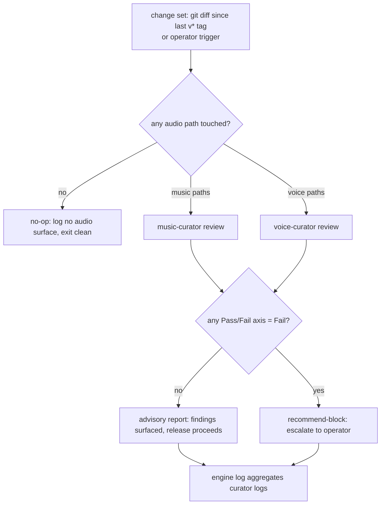

# Audio Regression Review

## Why this engine exists

`music-curator` and `voice-curator` are both **advisory consult** agents
— they self-describe as "call me before you change X". Nothing calls them
at release time. The `release-build-pipeline` gate is `security-guard →
build-doctor`; the test lane (`test-runner` / `test-sentinel`) does not
execute audio smoke tests by policy. So a change to any of these silently
ships:

- **Music** — `MelSpectrogram.ComputeLogMel` / AST normalization
  constants (wrong preprocessing degrades mAP with no exception), the
  `LoopbackCaptureService` sample-provider chain (wrong format = aliasing
  / DC offset / silence), `SpectrumBars` dBFS layout.
- **Voice** — the `SherpaSpeakerDiarizer` segmentation+embedding pair or
  sample rate (wrong pair degrades DER silently), the Whisper-text ×
  Sherpa-speaker interval-overlap merge (boundary drift), the
  voice-note `note.onTranscript` bridge schema.

Per `harness/creator-rule.md` Rule 2, a review needing **two agents** to
coordinate is an engine, not something embedded in either curator's file.
This engine codifies the routing so the curators fire on the changes that
actually touch their contracts — and only those.

## Change-detection routing

The engine's first job is to decide **which curator(s), if any, run** —
based on which watched paths the change set touches. No audio path
touched → engine is a no-op (exit clean, log "no audio surface in scope").

| Curator | Fires when the diff touches | Source of truth |
|---|---|---|
| `music-curator` | `Project/ZeroCommon/Music/**`, `Project/AgentZeroWpf/Services/Music/**`, `SettingsPanel.Music.cs`, Music-tab XAML | `harness/agents/music-curator.md` "Files this agent watches" |
| `voice-curator` | `Project/ZeroCommon/Voice/Diarization/**`, `SettingsPanel.Voice.cs`, `Project/Plugins/voice-note/**`, `Project/AgentZeroWpf/Services/Browser/WebDevHost.cs` (bridge) | `harness/agents/voice-curator.md` "Files this agent watches" |

Both may fire (a release can touch both lanes — e.g. shared
`LoopbackCaptureService` changes ripple into Voice's reused capture path).
They run **independently** — neither calls the other (Rule 1); the engine
collects both.

## Steps

1. **Scope** — determine the change set:
   - Under `release-build-pipeline` auto-invoke → `git diff <last v* tag>...HEAD --name-only`.
   - Operator trigger → uncommitted diff, or the range the operator names.
2. **Route** — match changed paths against the table above. If none match,
   write a one-line no-op engine log and exit. This is the common case for
   non-audio releases and must stay cheap.
3. **music-curator review (only if music paths touched)** — runs its
   "Mandatory / Advisory consult" checklist against the diff: preprocessing
   fidelity, format-conversion correctness, UI responsiveness,
   cross-model extensibility (per its rubric). Writes log under
   `harness/logs/music-curator/`.
4. **voice-curator review (only if voice paths touched)** — runs its
   checklist: model-pair fidelity, merge correctness, cross-source
   consistency, UI responsiveness (per its rubric). Writes log under
   `harness/logs/voice-curator/`.
5. **Verdict aggregation** — collect each curator's rubric result. Any
   **Pass/Fail axis returning Fail** (e.g. music format-conversion Fail,
   voice model-pair Fail) → engine verdict = **recommend-block**.
   A/B/C/D-axis weakness alone stays **advisory**.
6. **Engine log** — aggregate under
   `harness/logs/audio-regression-review/{yyyy-MM-dd-HH-mm-title}.md`
   with `linked_logs:` to the participating curator logs (Rule 6 —
   aggregator, not duplicator). Records: which lane(s) ran, verdict
   (advisory / recommend-block / no-op), and the gate decision if invoked
   under a release.

## Advisory vs recommend-block (not a hard gate)

Unlike `security-guard` in `release-build-pipeline` (which hard-stops the
build), the curators are advisory experts and audio regressions are
usually quality drift, not exploit surface. So:

- **Advisory (default)** — findings surface with file:line + fix; the
  release proceeds. Operator reads the engine log before tagging.
- **Recommend-block** — a Pass/Fail-axis Fail (broken capture format,
  wrong diarization pair, non-16 kHz sample rate) is a correctness bug,
  not a taste call. The engine recommends holding the tag and surfaces
  the failing axis. The **operator decides** whether to fix, waive
  (documented in the failing curator's log under a `## Waiver` section,
  same protocol as `release-build-pipeline`), or proceed anyway.

This engine never terminates a build on its own — it informs the operator
who owns the release-build-pipeline decision.

## Input

- Trigger phrase from operator (see frontmatter `triggers:`), OR
- Auto-invocation from `release-build-pipeline` when the release diff
  touches an audio-watched path.

## Output

- **No-op** — change set touches no audio path. One-line engine log.
- **Advisory** — findings surfaced, curator logs linked, release proceeds.
- **Recommend-block** — a Pass/Fail-axis Fail; operator resolves before
  tagging.

## Evaluation rubric

| Axis | Measure | Scale |
|---|---|---|
| Routing accuracy | Only the curator(s) whose watched paths changed were invoked (no false fire, no missed lane) | Pass/Fail |
| No-op discipline | Non-audio change sets exit cheap without invoking a curator | Pass/Fail |
| Verdict calibration | Pass/Fail-axis Fail → recommend-block; A/B/C/D weakness → advisory (not conflated) | A/B/C/D |
| Engine log shape | Aggregator only — links curator logs, no duplicated findings (Rule 6) | Pass/Fail |

## Cross-references

- Agent: `harness/agents/music-curator.md` — "Files this agent watches"
  is the source of truth for the music routing column; rubric axes reused
  verbatim in Step 3.
- Agent: `harness/agents/voice-curator.md` — same for the voice lane.
- Engine: `harness/engine/release-build-pipeline.md` — the release gate
  this review runs alongside. That engine stays `security-guard →
  build-doctor` (unchanged); this engine is a parallel advisory lane the
  operator consults, not a new hard gate wired into it.
- Rules: `harness/creator-rule.md` Rule 1 (curators never call each
  other), Rule 2 (2-agent coordination = engine), Rule 6 (engine log
  aggregates).

## Status

Ships **proactively** — no log under `harness/logs/audio-regression-review/`
yet. The v0.16.0 release (voice-note diarization chunk-scoping +
agent-band loopback fix) is exactly the change class this engine would
have routed to `voice-curator` + `music-curator`; it shipped before the
engine existed. The next audio-touching release is the first live run.

**Wiring — DONE.** The `release-build-pipeline` auto-invoke is now **Step 2**
of `harness/engine/release-build-pipeline.md` (conditional on audio-watched
paths, advisory by default, recommend-block escalates to operator, identical
Waiver protocol). The engine is also invocable standalone via its trigger
phrases.
