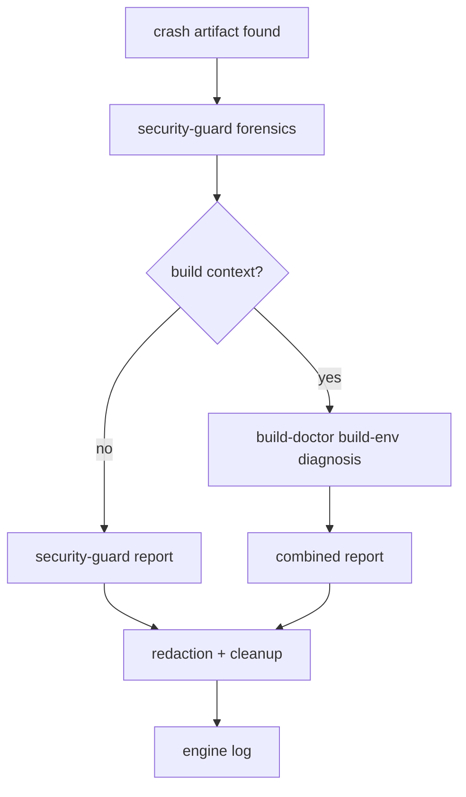

# Crash Dump Triage

## Why this engine exists

The crash-dump-forensics knowledge file declares two owners (`security-
guard` primary, `build-doctor` secondary) and tells each agent when its
phase fires. That's a multi-agent workflow per `harness/creator-rule.md`
Rule 2 — engines must define orchestration when 2+ agents collaborate.
Until 2026-05-04 the contract lived only inside the knowledge file's
prose; this engine pulls the hand-off into a first-class workflow so
other agents (tamer, code-coach during reviews) can audit it without
re-reading the playbook.

## Steps

1. **Detect** — operator surfaces a dump (`*.stackdump`, `*.dmp`,
   `core`, `crash-*.log`) in the working tree, or `git ls-files | grep`
   reveals one is tracked. Tracked dumps are themselves a finding —
   `.gitignore` should be catching them.
2. **security-guard forensics (always first)** — runs the playbook in
   `harness/knowledge/security-guard/crash-dump-forensics.md`:
   triage flow, dump-type identification, redaction rules, prior-incident
   lookup against `code-coach/cases/`. Writes log under
   `harness/logs/security-guard/`.
3. **Build-context check (gate)** — did the dump come from a build
   step (compile, installer, native DLL load, ConPTY init)? If not,
   stop — the security-guard report is the deliverable.
4. **build-doctor diagnosis (only if build-context)** — correlates the
   crash with the build environment: native DLL pinning drift, llama.cpp
   commit mismatch, MSVC runtime, Inno Setup invocation. Writes log
   under `harness/logs/build-doctor/`.
5. **Combined report** — engine summary log under
   `harness/logs/crash-dump-triage/{yyyy-MM-dd-HH-mm-title}.md` with
   `linked_logs:` to the participating agent logs (Rule 6 — engine logs
   are aggregators, not duplicators).
6. **Redaction + cleanup** — security-guard owns this: dumps may carry
   absolute paths, environment variables, or partial memory contents
   that must not survive in the working tree. Preferred remediation =
   delete the artifact after analysis; if it must be retained, redact
   in-place per the playbook.

## Input

- A crash artifact in the working tree, OR
- An operator trigger phrase (see frontmatter `triggers:`).

## Output

- Pass: dump analyzed, root cause filed, artifact removed or redacted.
  Engine log links both agent logs.
- Block: dump's content is itself a finding (e.g., contains an
  unredacted secret, points at an exploit chain). Surface to operator
  before removing — operator decides whether to pivot to security-
  incident workflow.

## Evaluation rubric

| Axis | Measure | Scale |
|---|---|---|
| Phase ordering | security-guard ran before build-doctor (never reversed) | Pass/Fail |
| Build-context decision | Correctly classified the dump's origin | A/B/C/D |
| Redaction completeness | All credentials/paths/env strings handled | Pass/Fail |
| Engine log shape | Aggregator only — no duplicated agent findings | Pass/Fail |

## Cross-references

- Knowledge: `harness/knowledge/security-guard/crash-dump-forensics.md`
  (the actual triage playbook — this engine sequences it, knowledge
  describes it).
- Agent: `harness/agents/security-guard.md` "Crash dump forensics"
  scope item — the agent file lists trigger phrases that fire this
  engine.
- Agent: `harness/agents/build-doctor.md` — picks up the build-context
  branch.
- Cases: `harness/knowledge/code-coach/cases/2026-04-22-msys2-bash-crash-llamacpp-build.md`
  is the origin incident that seeded the playbook (build-context dump
  during llama.cpp self-build).

## Status

This engine ships **proactively** — no log entry exists under
`harness/logs/crash-dump-triage/` yet because no production dump has
fired the workflow since codification (2026-04-22 incident predates
the playbook). Operator + tamer can invoke the workflow on the next
dump that surfaces; the engine log shape above is what's expected.
