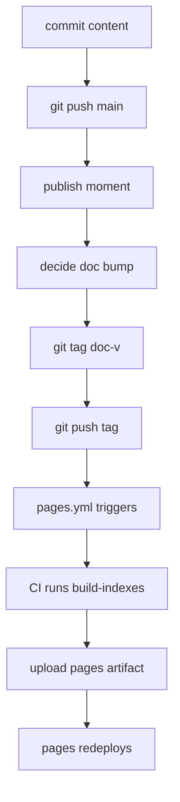

# Harness-view Publish

## Why this engine exists

Pages was previously rebuilt on every push to `main`. With harness/logs
churning multiple times per day, that meant 100+ unnecessary deploys per
week and broken caching downstream. The fix (2026-04-28) gated `pages.yml`
to `tags: doc-v*` only — but that means publish is now a deliberate act
the operator schedules, not a side-effect of pushing. This engine
documents the orchestration so it doesn't drift across skill, README,
and folk knowledge.

## Steps



1. **Decide if this push needs to publish.** Routine work
   (logs / new docs / skill sync) can ride main; publish is a separate
   cadence the operator schedules at meaningful checkpoints (mission
   batch closed, release shipped, content milestone).
2. **Confirm `main` is clean and pushed** before tagging.
3. **Pick the doc-v bump level** — semantic but **independent** of the
   app's `v*` tag namespace (which `release.yml` owns). Use minor for
   new content sections, patch for copy edits / index fixes, major for
   structural / template changes.
4. **Annotated tag** with a 1-line theme + 2–4 bullet body (commits
   since previous `doc-v*`):
   ```bash
   git tag -a doc-v1.7.0 -m "$(cat <<'EOF'
   harness-view doc-v1.7.0 — <theme>
   - <bullet>
   - <bullet>
   EOF
   )"
   ```
5. **Push the tag.** That's the publish trigger:
   ```bash
   git push origin doc-v1.7.0
   ```
6. **CI rebuild** — `pages.yml` checks out the tag, runs
   `build-indexes.js`, materialises `_resources/`, uploads `Home/` as
   the Pages artifact. ~30–60s end-to-end.
7. **Operator verifies** at the Pages URL. If broken, escape hatch is
   the *Run workflow* button on `pages.yml` (workflow_dispatch) for
   re-trigger without a new tag.

## Auto-refresh contract per dashboard widget

| Widget | Behaviour at publish | Manual? |
|---|---|---|
| Build Log | Auto-refreshes from `harness/docs/*.md` index | No |
| Recent Updates | Stays put — operator-curated `news.json` | **Yes** |
| PDSA Learning | Stays put — operator-curated `pdsa-insight.json` | **Yes** (only on meaningful activity) |
| Contributors | **Auto-refreshes** — `gitContributors()` recomputes per build over `harness/`+`Docs/`+`Home/harness-view/` (since 2026-05-03) | No |
| Workflow | Static `workflow-graph.json` (Core) + engine manifest (Task) | News=manual, Engine cards=auto |
| Roles / Skills / Knowledge / Activity / Design / Missions | Auto from manifests | No |

So a publish that ships nothing but a `harness/agents/foo.md` change
will refresh Roles + Contributors + Activity automatically; PDSA + News
ride forward unchanged unless operator preemptively updated them.

## Input

- A pushed-to-main commit chain operator wants to publish.
- A doc-v bump decision.

## Output

- New `doc-v<x.y.z>` annotated tag on `origin`.
- Pages site refresh (CI-time rebuild — single source of truth =
  in-repo content, not whatever the local index manifest happened to
  hold).

## Why this lives in `harness/engine/` and not just in the skill

The skill (`.claude/skills/harness-view-build/`) is the **interface**;
this engine is the **workflow**. Other agents that audit publish state
(release-build-pipeline, code-coach reviewing `harness-view/` changes)
consult the engine, not the skill, because the engine's contract stays
stable even if the skill's prose evolves.

## Cross-references

- Skill: `.claude/skills/harness-view-build/SKILL.md` (BUILDER mode +
  Publish section)
- CI: `.github/workflows/pages.yml` (the actual gate)
- Indexer: `Home/harness-view/scripts/build-indexes.js`
