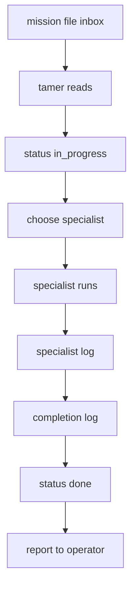

# Mission Dispatch

## Why this engine exists

Operator-to-harness requests used to live entirely in chat (vibe-level,
ephemeral, hard to audit). The missions subsystem captured them as files;
this engine captures the **orchestration** of how those files move from
inbox to done. Previously this lived inside `tamer.md` (agent procedure)
and `missions-protocol.md` (data contract); pulling the workflow into an
engine lets other agents (build-doctor, code-coach, security-guard) and
the harness viewer reason about the lifecycle without re-deriving it.

## Steps

1. **Read** `harness/missions/M{NNNN}-*.md` via Glob. If multiple match,
   take the first and warn. If none, ask operator to write the brief.
2. **Capture frontmatter** — `language`, `status`, `operator`. Reject
   re-execution if `status: done | cancelled` (operator must say
   "M{NNNN} 다시 수행해" to override).
3. **Flip status** to `in_progress` with start timestamp via Edit.
4. **Dispatch** based on the body's `# 요청`. Mapping table lives in
   `harness/knowledge/tamer/missions-protocol.md` "Dispatch — how tamer picks
   the specialist". Multiple specialists in sequence allowed.
5. **(Optional) Pencil step** — if the brief asks for a `.pen` design,
   write to `Docs/design/M{NNNN}-{slug}.pen`. Indexer pairs by `M{NNNN}`
   prefix; see `.claude/skills/harness-view-build/references/data-contracts.md`
   Rule 5.
6. **Specialist logs** — each agent writes its own log under
   `harness/logs/{agent}/`. Don't intercept; the engine just orchestrates.
7. **Completion log** — tamer writes
   `harness/logs/mission-records/M{NNNN}-수행결과.md` (Korean missions)
   or `M{NNNN}-execution-result.md` (English). Filename **must** start
   with `M{NNNN}` per indexer regex `^(M\d+)\b`. Frontmatter has 9 fields
   (mission / title / operator / language / dispatched_to / status /
   started / finished / artifacts).
8. **Flip mission status** to `done | partial | blocked | cancelled`.
9. **Report** to operator in the mission's language (not the chat
   language) per the language-fidelity rubric.

## Input

- Mission file at `harness/missions/M{NNNN}-*.md` (operator-authored).
- Trigger phrase from chat or skill invocation.

## Output

- Mission file `status` advanced through `inbox → in_progress → done`.
- Completion log under `harness/logs/mission-records/`.
- Per-specialist logs (tamer doesn't write these; specialists do).
- Operator-facing report.

## Evaluation rubric (engine-level)

| Axis | Measure | Scale |
|---|---|---|
| Dispatch accuracy | Right specialist picked for the brief | A/B/C/D |
| Mission language fidelity | Completion log matches mission's `language` | Pass/Fail |
| Acceptance coverage | All checklist items in the brief addressed | A/B/C/D |
| Status hygiene | inbox → in_progress → done transitions all happened | Pass/Fail |
| Filename contract | Completion log starts with `M{NNNN}\b` | Pass/Fail |

Failures here surface in the harness-view Missions card as `recordFile: null`
(filename rule violation) or visible status drift.

## Cross-references

- Data contract: `harness/knowledge/tamer/missions-protocol.md`
- Filename rule: `.claude/skills/harness-view-build/references/data-contracts.md`
- Agent procedure: `harness/agents/tamer.md` (this engine is the workflow
  view of the same procedure — agent file stays as the "what tamer does"
  reference, engine file stays as the "what the lifecycle looks like"
  reference).
