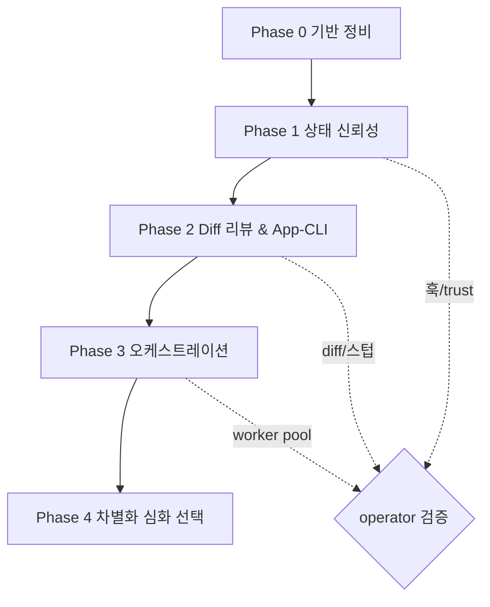

# orca Adoption

## Why this engine exists

AgentZero Lite와 orca는 동일 제품군(멀티-CLI 에이전트 셸)이지만 orca가 훨씬
성숙하다. orca의 개발자 지원(ADE) 기능을 통째로 베끼는 것이 아니라 **아이디어와
명세만** 선별 이식한다. 구현은 TS/Electron이라 재사용 불가. 이 엔진은 그 선별
영입을 페이즈 단위로 추적해, 어느 specialist가 이어받아도 맥락을 재구성할 필요가
없게 한다.

## Source of truth

- **분석/계획 정본**: `Docs/agent-orca/{README,01-orca-feature-catalog,02-phase-plan}.md`
- **orca 참조본**: `E:\git-other\orca` (shallow clone, 읽기 전용 — 재조회 전용)
- 계획을 벗어나는 판단이 필요하면 참조본을 다시 열람하고 `Docs/agent-orca/`를 갱신한다.

## Phases

| Phase | 핵심 | orca 기능 | 우선순위 |
|---|---|---|---|
| P0 | 기반 정비 (문서·엔진·toolbelt 검토) | — | 진행중 |
| P1 | 에이전트 훅 + trust preset | E, F | P0 |
| P2 | Diff 리뷰 주석→재투입 + App-CLI/스킬 스텁 | H, D, C | P1 |
| P3 | Run/Task/Dispatch 오케스트레이션 + worktree 워크스페이스 | A | P1 |
| P4 | PTY 데몬 / $비용·팔레트 / Design Mode / 자동화 / 플러그인 | B,K,G,J,I | P2~P3 |

세부 태스크 체크리스트는 `Docs/agent-orca/02-phase-plan.md`에 있으며, 진행에 맞춰
`[ ]/[~]/[x]`를 갱신한다.

## Steps (per phase)

1. **착수 로그** — `harness/logs/orca-adoption/{yyyy-MM-dd-HH-mm}-P{N}-start.md`.
   대상 페이즈 태스크와 영향 파일(액터/toolbelt/엔티티)을 명시.
2. **Dispatch** — 페이즈 성격에 맞는 specialist 배정:
   - 훅/CLI/액터 배선 → code-coach
   - 빌드/마이그레이션/csproj → build-doctor
   - 헤드리스 테스트 설계 → test-sentinel
   - 보안 민감(trust preset, 파일 도구) → security-guard
3. **Implement** — `ZeroCommon` 우선(헤드리스), WPF 의존은 `AgentZeroWpf`로 분리.
   액터 레이어 WPF import 금지 규칙 준수.
4. **Test** — 신규 로직은 `ZeroCommon.Tests`(헤드리스)에 유닛 테스트. 데스크톱 의존은 `AgentTest`.
5. **완료 로그 + 3축 평가** — `…-P{N}-done.md`. 체크리스트 갱신.
6. **operator 검증 게이트** — 회귀/델타는 완료 로그에 `## 후속 수정 #N`으로 append.
7. **버전/커밋** — 구조 변경 시 `harness.config.json` + `harness/docs/vX.Y.Z.md` 갱신.
   operator 승인 후에만 commit + push.

## Input

- 트리거 문구(`orca 페이즈 P{N} 진행해` 등) 또는 스킬 인자.
- 계획 정본 `Docs/agent-orca/02-phase-plan.md`의 해당 페이즈 체크리스트.

## Output

- 페이즈 착수/완료 로그 (`harness/logs/orca-adoption/`).
- 체크리스트 상태 전진 (`02-phase-plan.md`).
- specialist별 코드 산출물 + 헤드리스 테스트.

## Evaluation rubric (engine-level)

| Axis | Measure | Scale |
|---|---|---|
| 코드 안전성 | 신뢰 파일 기록/파일 도구/IPC 경계가 안전한가 | A/B/C/D |
| 아키텍처 정합성 | 단방향 의존 + 액터 WPF 비의존 + 메시지 불변성 준수 | Pass/Fail |
| 테스트 가능성 | 신규 로직이 헤드리스로 검증되는가 | A/B/C/D |
| 이식 충실도 | orca 명세를 재사용 아닌 개념 이식으로 옮겼는가 | Pass/Fail |
| 스코프 규율 | Lite 범위 유지(고비용 P4는 개별 승인) | Pass/Fail |

## Cross-references

- 계획 정본: `Docs/agent-orca/README.md`, `01-orca-feature-catalog.md`, `02-phase-plan.md`
- orca 참조본: `E:\git-other\orca`
- 관련 코드 진입점: `Project/ZeroCommon/Llm/Tools/IAgentToolbelt.cs` +
  `AgentToolGrammar.cs`(신규 도구), `Project/ZeroCommon/Actors/Messages.cs`(액터 메시지),
  `Project/AgentZeroWpf/CliHandler.cs`(CLI 확장), `Project/ZeroCommon/Data/AppDbContext.cs`(엔티티).
