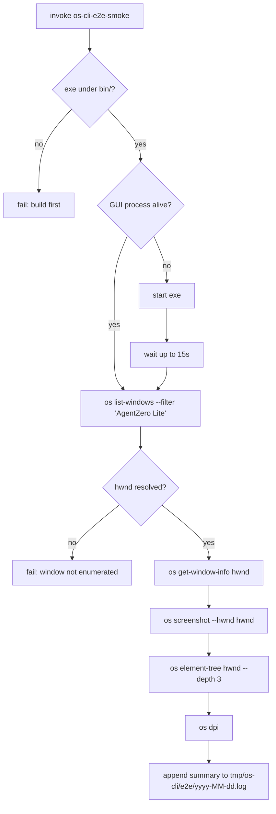

# OS-CLI E2E Smoke

## Why this engine exists

Mission M0014 brought OS-control verbs into the CLI. The completion
criterion is not just "code compiles" — it's "the operator can drive
the desktop from a shell to verify a fresh build still launches and the
window tree is reachable." This engine codifies that lifecycle so any
agent (test-runner, tamer, build-doctor) can fire it without re-deriving
the steps.

This is the **read-only** smoke. A future engine may add input-driven
flows once approval gating + per-tool human-in-the-loop confirmation is
in place; until then this engine intentionally restricts itself to
list-windows / get-window-info / screenshot / element-tree.

## Steps

1. **Resolve exe** — `Project/AgentZeroWpf/bin/<config>/net10.0-windows/AgentZeroLite.exe`.
   Default `Configuration=Debug`; pass `Release` when running against an
   installed build.
2. **Process check** — `Get-Process AgentZeroLite | Where-Object { $_.MainWindowHandle -ne 0 }`.
   If no live GUI, launch it and poll up to 15s.
3. **`os list-windows --filter "AgentZero Lite"`** — extract hwnd of the
   first match.
4. **`os get-window-info <hwnd>`** — capture rect/pid/process to log.
5. **`os screenshot --hwnd <hwnd>`** — produces a PNG under
   `tmp/os-cli/screenshots/<date>/`. Path is logged.
6. **`os element-tree <hwnd> --depth 3`** — proves UI Automation tree is
   reachable. Failure here is a WARN (some shell states minimize the
   window mid-run), not a hard fail.
7. **`os dpi`** — pure local probe; useful for diagnosing screenshot
   scaling regressions.
8. **Summary log** — append to `tmp/os-cli/e2e/<date>.log`. The
   completion log for the mission references this file as an artefact.

## Input

- Optional: `Configuration` parameter (Debug | Release | AgentCLI).
- Optional: `LaunchTimeoutSec` parameter for slow desktops.

## Output

- Exit code 0 = all steps passed; 1 = one or more steps failed.
- `tmp/os-cli/screenshots/<date>/<HH-mm-ss-fff>-hwnd-<n>.png` — captured PNG.
- `tmp/os-cli/audit/<date>.jsonl` — audit JSONL with one line per CLI verb.
- `tmp/os-cli/e2e/<date>.log` — human-readable summary, multiple runs append.

## Evaluation rubric (engine-level)

| Axis | Measure | Scale |
|---|---|---|
| Reachability | os list-windows returns ≥ 1 match for "AgentZero Lite" | Pass/Fail |
| Capture integrity | screenshot PNG file exists and width/height > 0 | Pass/Fail |
| UIA tree reachable | element-tree returns nodeCount ≥ 1 (depth 3) | Pass/Fail (warn-only) |
| Audit trail intact | tmp/os-cli/audit/<date>.jsonl gained ≥ 4 entries this run | Pass/Fail |
| No input-simulation drift | no `mouse_*` or `key_press` rows in audit | Pass/Fail |

## Cross-references

- Implementation: `Project/AgentZeroWpf/OsControl/`
- CLI dispatch: `Project/AgentZeroWpf/OsControl/OsCliCommands.cs`
- LLM toolbelt bridge: `Project/AgentZeroWpf/Services/WorkspaceTerminalToolHost.cs`
- PowerShell harness: `Docs/scripts/launch-self-smoke.ps1`
- Knowledge: `harness/knowledge/_shared/os-control.md`
