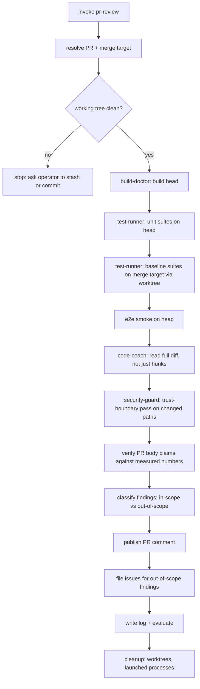

# PR Review

## Why this engine exists

`pre-commit-review` answers "is this diff sane?" in seconds, from one
reviewer, on staged files. A pull request asks a bigger question: *did the
work actually land, and does the branch still hold together?* That needs
things a diff read cannot supply —

- a **build**, because a diff that reads fine can still not compile;
- **both** test suites, because `ZeroCommon.Tests` and `AgentTest` fail for
  different reasons and only one of them runs unattended;
- a **baseline run on the merge target**, because "483 tests pass" means
  nothing without knowing what main scores;
- the **e2e smoke**, because unit-green has never proven the app launches;
- verification that the PR **body's own claims** match what the commands print.

Before this engine existed, that combination was assembled by hand each
time from `code-coach` + `test-runner` + `build-doctor`, which meant the
steps were re-derived (and quietly varied) every cycle. This file pins them.

The engine is **advisory and additive**: its product is a comment plus
issues, never a state change on the PR.

## Steps



1. **Resolve the PR** — `gh pr view <n> --json title,body,state,files,additions,deletions`.
   With no number given, resolve from the current branch
   (`gh pr list --head $(git rev-parse --abbrev-ref HEAD) --state all`).
   Record the merge target; everything below compares against it, not
   against an assumed `main`.

2. **Pre-flight** — `git status --short` must be empty. A dirty tree
   contaminates every measurement below. Stop and ask rather than stashing
   on the operator's behalf.

3. **Build** (`build-doctor`) — `dotnet build Project/AgentZeroWpf/AgentZeroWpf.csproj -c Debug`.
   Record error and warning counts. **Classify the warnings**: a count alone
   is not a finding — `10 warnings` that are all one stale `NU1903` pin is a
   different report than 10 distinct ones.

4. **Unit suites on head** (`test-runner`) — both, and record both:
   ```bash
   dotnet test Project/ZeroCommon.Tests/ZeroCommon.Tests.csproj
   dotnet test Project/AgentTest/AgentTest.csproj
   ```
   Then a focused run over the tests the PR adds or touches. See
   "Known gate hazards" — `AgentTest` totals are not currently stable, so
   report its run count alongside its verdict, never the verdict alone.

5. **Baseline on the merge target** (`test-runner`) — this is the step that
   makes the head numbers mean something:
   ```bash
   git worktree add "$TEMP/az-baseline" <merge-target>
   dotnet test "$TEMP/az-baseline/Project/ZeroCommon.Tests/ZeroCommon.Tests.csproj"
   git worktree remove "$TEMP/az-baseline" --force
   ```
   Use a worktree, never `git checkout` — checking out mutates the branch
   under review and strands the operator if the run dies partway.

6. **E2E smoke** — run `os-cli-e2e-smoke` (`Docs/scripts/launch-self-smoke.ps1`).
   If the script fails, **reproduce its individual steps by hand before
   blaming the PR**: the failure is at least as likely to be in the probe as
   in the product (this is exactly how issue #13 was found). Record which of
   the two it was; that distinction is the whole value of the step.

7. **Diff review** (`code-coach`) — read changed files in full, not hunks.
   Then, specific to a PR rather than a commit:
   - **Doc/comment vs behaviour** — does an XML doc claim coverage the code
     does not have? Claims that outrun the implementation are the most
     common PR-scale defect and are invisible in a hunk view.
   - **Sibling paths** — if a guard is added to one failure branch, check
     the neighbouring branches that share its failure class. A fix wired
     into one of three call sites is a finding, not a completion.
   - **Cross-references** — for added `harness/knowledge/**` docs, confirm
     every referenced path exists and that code claims match the code.
     A knowledge file that cites a moved file is worse than none.

8. **Trust-boundary pass** (`security-guard`) — only on the paths the PR
   touches. State plainly when a finding is a **pre-existing convention**
   the PR merely follows rather than something the PR introduces; the
   severity is different and conflating them burns the reviewer's credit.

9. **Verify the PR body** — every number in its Verification section gets
   checked against what the commands actually printed, and internal
   consistency too (a body claiming "+10 tests" and "5 tests added" is
   wrong regardless of which figure is right).

10. **Classify findings** — in-scope (this diff) vs out-of-scope (found
    while verifying). Never mix them in the same list; an operator reading
    a PR comment needs to know what blocks *this* merge.

11. **Publish** — see Output. Then **cleanup**: remove worktrees, close any
    GUI the smoke launched (`CloseMainWindow`, not `Kill`), confirm
    `git status --short` is empty again.

## Input

- Optional: PR number. Defaults to the PR for the current branch.
- Optional: `Configuration` (Debug | Release) for build + e2e. Default Debug.
- Optional: `skip_e2e` — for a docs-only PR, where a desktop session is
  unavailable, or when issue #13 is still open and the probe cannot pass.
  A skipped step is **reported as skipped**, never silently dropped.

## Output

- **PR comment** — the deliverable. Structure:
  1. Verification table — one row per gate, with the actual command's numbers
  2. Verdict — one of the four below
  3. Must-fix / Should-fix / Suggestion, each with `file:line` and a rewrite
  4. PR-body corrections, if the body's claims don't match measurement
  5. Out-of-scope findings, explicitly fenced off, with issue links
  6. What the PR got right — specific, not a courtesy line
- **GitHub issues** — one per out-of-scope cluster, per the "GitHub issue
  handoff" procedure in `harness/agents/code-coach.md`. In-scope findings
  live in the comment, not in issues; the PR is already their tracker.
- **Engine log** — `harness/logs/pr-review/{yyyy-MM-dd-HH-mm-title}.md`,
  recording every command run and its measured result, so a later reader can
  tell measurement from inference.

### Verdicts

| Verdict | Meaning |
|---|---|
| `approve-with-comments` | No must-fix. Findings are follow-up work. |
| `changes-requested` | ≥1 must-fix, or a red gate the PR introduced. |
| `blocked-on-gate` | A gate could not run at all (e.g. e2e probe broken). Says nothing about the diff — do not let it read as a verdict on the code. |
| `insufficient-evidence` | A suite too unreliable to draw a conclusion from. Report the instability; don't launder it into a pass. |

**The engine never runs `gh pr merge`, `gh pr close`, or `gh pr review
--approve`.** It comments. The merge decision is the operator's, and an
advisory reviewer that can close PRs stops being advisory.

## Known gate hazards

Check these before reporting a gate red — each has an open issue, and
attributing a known-broken gate to the PR under review is a false positive:

| Gate | Hazard | Issue |
|---|---|---|
| e2e | `launch-self-smoke.ps1` cannot capture WinExe stdout — always fails at step 2 | #13 |
| e2e | `os element-tree` hangs with no timeout | #13 |
| `AgentTest` | Run totals vary 143–151; short runs report success without executing | #14 |
| build | 10 × `NU1903` from one stale pin — expected, not new | #15 |

Keep this table current. An engine that cries wolf about its own
infrastructure trains the operator to skim its output.

## Evaluation rubric (engine-level)

| Axis | Measure | Scale |
|---|---|---|
| Evidence completeness | Every gate either ran or is reported as skipped with a reason | Pass/Fail |
| Baseline discipline | Head numbers reported against a measured merge-target baseline | Pass/Fail |
| Scope hygiene | In-scope vs out-of-scope findings separated; out-of-scope filed as issues | Pass/Fail |
| Claim verification | Every number in the PR body checked against measurement | Pass/Fail |
| Non-destructive | No merge/close/approve; worktrees removed; launched processes closed; tree clean | Pass/Fail |
| Finding quality | Each finding has `file:line`, a concrete rewrite, and a stated failure mode | A/B/C/D |

## Cross-references

- Reviewer definition + issue handoff: `harness/agents/code-coach.md`
- Build gate: `harness/agents/build-doctor.md`
- Test gate: `harness/agents/test-runner.md`
- Trust boundaries: `harness/agents/security-guard.md`
- E2E probe: `harness/engine/os-cli-e2e-smoke.md`
- Staged-diff sibling: `harness/engine/pre-commit-review.md`
- Worked example (the run this engine was extracted from):
  `harness/logs/code-coach/2026-08-20-02-52-pr12-p0-cleanup-verification-review.md`
