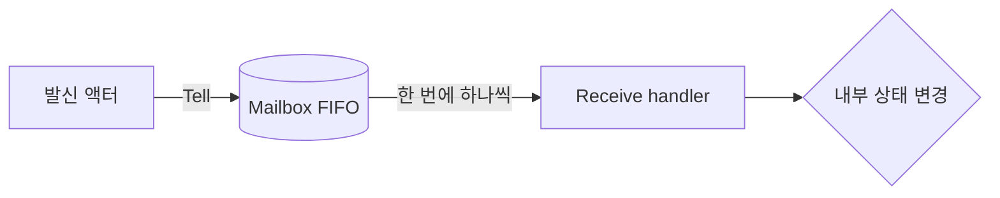
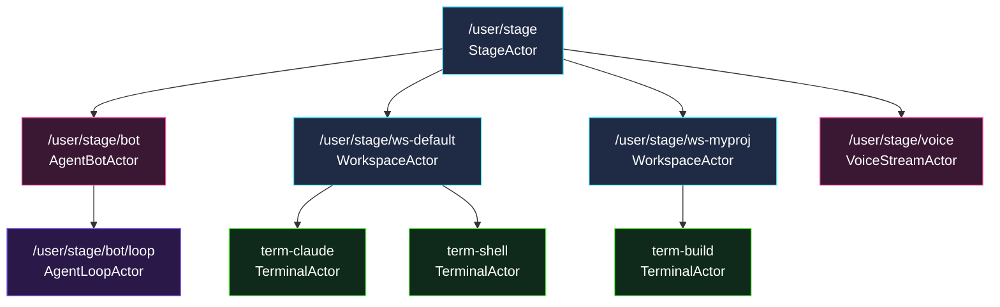
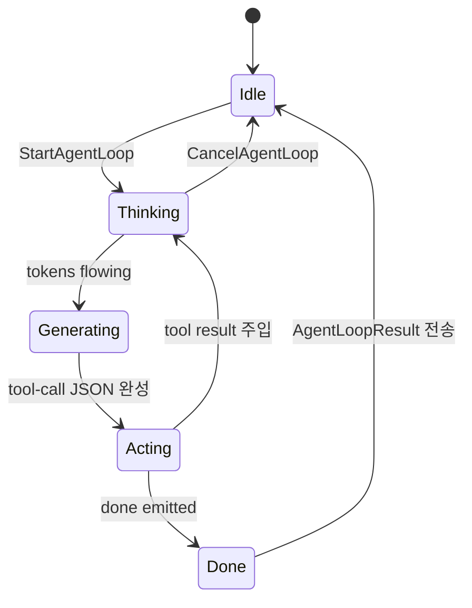
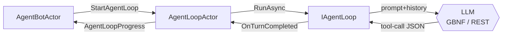
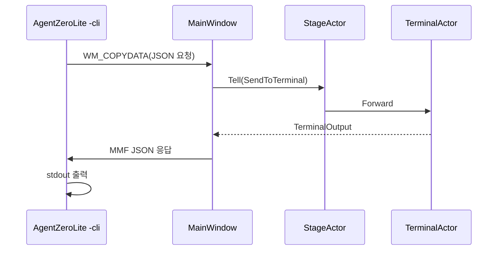

# Akka.NET 액터모델 듀토리얼 — AgentZero Lite 의 시선으로

> **이 듀토리얼은 한국어 전용**입니다. 영문 원본 / 정식 레퍼런스가 필요하면
> [Akka.NET 공식 — *What is Akka?*](https://getakka.net/articles/intro/what-is-akka.html)
> 를 먼저 한 번 훑어보고 오면 좋습니다. 본 문서는 같은 개념을 **AgentZero Lite
> 프로젝트가 실제로 사용하는 패턴** 으로 풀어 설명합니다.

---

## 0. 왜 액터모델인가 — 한 줄 요약

> **"공유 메모리에 락을 거는 대신, 상태를 액터에 가두고 메시지만 주고받자"** —
> 이게 액터모델의 전부입니다.

AgentZero Lite 는 WPF GUI + ConPTY 터미널 + LLM 추론 + CLI IPC + 음성 입력 +
OS 자동화 까지 한 프로세스 안에서 동시에 굴립니다. 이 동시성을 그냥 스레드 +
lock 으로 풀면:

1. UI 스레드가 LLM 추론을 기다리며 멈춤
2. ConPTY write 가 다른 스레드의 read 와 경합
3. CLI IPC 가 다른 곳에서 같은 터미널을 건드림
4. 음성 STT 결과가 UI 스레드로 들어와야 함

— 라는 4개 축의 경합을 한꺼번에 풀어야 합니다. 액터모델은 **각 축마다 한 액터** 를
배치하고, 그 액터의 메일박스 (FIFO 큐) 가 자기 상태에 대한 직렬화를 보장합니다.
스레드 안전을 명시적으로 코드에 적지 않아도 자동으로 따라옵니다.

---

## 1. 액터모델의 5가지 기본 개념

### 1.1 Actor — 자신의 상태를 가진 객체

액터는 **자신의 필드(state)를 외부로 노출하지 않는** 객체입니다. 외부에서
액터의 상태를 바꾸려면 **메시지를 보내야 합니다.**

```csharp
public sealed class TerminalActor : ReceiveActor
{
    private string _terminalId;      // ← 외부에서 절대 직접 못 만짐
    private ITerminalSession? _session;
    private nint _hwnd;

    public TerminalActor(string terminalId, string sessionId, string workspaceName)
    {
        _terminalId = terminalId;
        // ...
        BuildHandlers();   // ← 어떤 메시지에 어떻게 반응할지 등록
    }
}
```

> 출처: `Project/ZeroCommon/Actors/TerminalActor.cs:18`

### 1.2 Message — 액터끼리의 유일한 의사소통 수단

메시지는 **불변 record** 로 정의합니다. AgentZero Lite 는 모든 메시지를
`Project/ZeroCommon/Actors/Messages.cs` 한 파일에 모아두었습니다.

```csharp
// 예: 워크스페이스 안의 특정 터미널에 텍스트를 쓰라는 메시지
public sealed record SendToTerminal(string WorkspaceName, string TerminalId, string Text);

// 예: 동기 응답 패턴 — 질의 / 응답이 record 쌍으로 정의됨
public sealed record QueryActiveTerminal;
public sealed record ActiveTerminalResponse(string? WorkspaceName, string? TerminalId);
```

> 출처: `Project/ZeroCommon/Actors/Messages.cs:51`

`record` 라는 점이 중요합니다 — 발신 후 송신자가 같은 객체를 변경해도 수신
액터의 메시지가 바뀌지 않습니다. **불변성 = 동시성 안전.**

### 1.3 Mailbox — FIFO 큐

각 액터는 **메일박스 1개** 를 가지며, 들어온 메시지를 **들어온 순서대로
하나씩** 처리합니다. 동시에 두 메시지를 처리하지 않습니다 → 내부 상태에
락이 필요 없습니다.



### 1.4 Behavior — Become 으로 상태머신 만들기

`Receive<T>(handler)` 가 같은 메시지에 대해 **현재 어떻게 반응할지** 를
정의합니다. `Become(newBehavior)` 호출 시 그 행동 집합 자체가 통째로 교체
됩니다. AgentBotActor 가 Chat 모드 / Key 모드를 이렇게 전환합니다:

```csharp
public AgentBotActor(IActorRef stage)
{
    _stage = stage;
    _stage.Tell(new RegisterBot());
    BecomeChat();   // 첫 행동은 Chat 모드
}

private void BecomeChat()
{
    Become(() =>
    {
        CommonHandlers();
        Receive<UserInput>(msg => /* 채팅으로 처리 */);
        Receive<SwitchBotMode>(msg =>
        {
            if (msg.TargetMode == BotMode.Key) BecomeKey();
        });
    });
}
```

> 출처: `Project/ZeroCommon/Actors/AgentBotActor.cs:64`

### 1.5 Supervision — "let it crash"

자식 액터가 예외를 던지면 **부모가 어떻게 처리할지** 를 결정합니다. 기본
전략은 *Restart* — 자식을 새로 만들고 메일박스의 다음 메시지부터 다시 시작
합니다. StageActor 는 이를 활용해 워크스페이스/터미널 장애를 격리합니다:

```csharp
protected override void PreRestart(Exception reason, object message)
{
    AppLogger.Log($"[Stage#{GetHashCode()}] PreRestart: reason={reason.GetType().Name}: {reason.Message}");
    base.PreRestart(reason, message);
}
```

> 출처: `Project/ZeroCommon/Actors/StageActor.cs:32`

---

## 2. AgentZero Lite 의 액터 토폴로지 — 한눈에 보기



핵심 규칙:
- **부모-자식** 관계는 메시지 라우팅이 아니라 **감독(Supervision)** 의 단위.
- 메시지 라우팅은 `Tell` / `Forward` 로 어디든 보낼 수 있음 (예: Stage 가
  `BindSessionInWorkspace` 를 받은 뒤 해당 워크스페이스로 Forward).
- 액터 경로의 마지막 세그먼트에 사용자 입력을 그대로 넣지 말 것 →
  `ActorNameSanitizer` 가 `/`, `:`, 공백 등을 정리.

---

## 3. 각 액터 파트 상세

### 3.1 StageActor — 모든 것의 부모, 메시지 브로커


**경로**: `/user/stage` · **출처**: `Project/ZeroCommon/Actors/StageActor.cs`

역할 3줄 요약:
1. Workspace / Bot 자식 액터 생명주기 관리
2. 전체 상태 집계 (`QueryStageStatus`)
3. 감독 전략으로 자식 장애 격리

자주 받는 메시지:

```csharp
Receive<RegisterWorkspace>(HandleRegisterWorkspace);
Receive<UnregisterWorkspace>(HandleUnregisterWorkspace);
Receive<RegisterBot>(HandleRegisterBot);
Receive<CreateTerminalInWorkspace>(msg =>
{
    if (_workspaces.TryGetValue(msg.WorkspaceName, out var ws))
        ws.Tell(new CreateTerminal(msg.TerminalId, msg.SessionId));
});
```

> 출처: `Project/ZeroCommon/Actors/StageActor.cs:51-69`

> **Tip** — `_botActor` 같이 자식 액터 참조를 캐시할 때는 `IActorRef?` 로
> nullable 처리하고 첫 생성 시점에서 `Context.ActorOf` 로 만드세요. 이미
> 있으면 그대로 반환 (idempotent).

### 3.2 AgentBotActor — UI 게이트웨이


**경로**: `/user/stage/bot` · **출처**: `Project/ZeroCommon/Actors/AgentBotActor.cs`

역할:
1. **Chat / Key 2가지 모드** 전환 — `Become()` 활용
2. **UI 콜백 게이트웨이** — 액터 → UI 스레드로 상태 푸시
3. **Peer-signal 라우팅** — `Claude` 같은 외부 peer 신호 추적
4. **첫 접촉 인사(intro)** 추적 — 같은 터미널에 두 번 인사하지 않음

```csharp
private readonly HashSet<(int g, int t)> _introducedTerminals = new();

// AIMODE first-contact tracking. WorkspaceTerminalToolHost asks via
// IntroduceTerminalIfFirst before sending; the reply tells it whether to
// prepend a self-intro.
```

> 출처: `Project/ZeroCommon/Actors/AgentBotActor.cs:29`

**중요 — Bot 은 추론을 하지 않습니다.** 추론은 자식 `AgentLoopActor` 가
담당합니다. Bot 은 *"누구한테 말할까 / 어떤 모드냐 / UI 에 어떻게 보여줄까"* 만
관리합니다. 두 액터가 같은 일을 한다고 착각하기 쉬운데, **추론과 UI 는 스레드를
공유하면 안 되기 때문에** 의도적으로 분리되어 있습니다.

### 3.3 AgentLoopActor — *진짜 에이전트*


**경로**: `/user/stage/bot/loop` · **출처**: `Project/ZeroCommon/Actors/AgentLoopActor.cs`

이 액터가 *Building effective agents* 포스트가 말하는 **agent loop** 그 자체
입니다. FSM 으로 한 턴을 돕니다:



핵심은 **각 phase 전환마다 부모 Bot 에게 `AgentLoopProgress` 를 Tell** —
UI 가 "지금 LLM 이 뭘 하고 있는지" 를 실시간으로 알 수 있게 됩니다.

```csharp
private void BecomeIdle()
{
    Become(() =>
    {
        Receive<StartAgentLoop>(msg =>
        {
            _runStartedAtTicks = Now();
            _round = 0;
            _cts = new CancellationTokenSource();

            if (_loop is null)
            {
                var host = _bindings.ToolbeltFactory();
                var baseOpts = _bindings.OptionsFactory();
                var wired = baseOpts with
                {
                    OnTurnCompleted = turn => Self.Tell(new TurnCompletedInternal(turn)),
                    OnGenerationProgress = (phase, tokens) =>
                        Self.Tell(new GenerationProgressInternal(phase, tokens)),
                };
                var loop = _bindings.AgentLoopFactory(wired, host);
                // ...
            }
        });
    });
}
```

> 출처: `Project/ZeroCommon/Actors/AgentLoopActor.cs:51-79`

> **Tip — 스레드풀 ↔ 액터 mailbox 다리** — `OnTurnCompleted`, `OnGenerationProgress` 같은
> 콜백은 LLM 스레드풀에서 호출됩니다. 직접 액터 필드에 손대면 안 됩니다.
> 대신 **`Self.Tell(new ...Internal(...))`** 로 자기 메일박스에 던져 넣으면,
> 모든 상태 변경이 액터의 단일 스레드 안에서 직렬화됩니다.

### 3.4 WorkspaceActor — 워크스페이스 = 폴더 한 개의 우주


**경로**: `/user/stage/ws-{workspaceName}` · **출처**: `Project/ZeroCommon/Actors/WorkspaceActor.cs`

이 액터는 사용자가 IDE 에서 *"폴더 열기"* 한 단위에 1:1 대응합니다. 자식으로
**TerminalActor 를 N개** 보유하며, 자기 안의 터미널 ID → IActorRef 매핑을
직접 가집니다.

```csharp
private readonly Dictionary<string, IActorRef> _terminals = new();

Receive<CreateTerminal>(HandleCreateTerminal);
Receive<DestroyTerminal>(HandleDestroyTerminal);

// 세션 바인딩 — TerminalId로 자식 터미널 찾아서 Forward
Receive<BindSessionInWorkspace>(msg =>
{
    if (_terminals.TryGetValue(msg.TerminalId, out var term))
        term.Tell(new BindSession(msg.Session));
    else
        _log.Warning("BindSession: terminal not found: {0} in workspace {1}",
            msg.TerminalId, _workspaceName);
});
```

> 출처: `Project/ZeroCommon/Actors/WorkspaceActor.cs:24-58`

**이름에 사용자 입력을 그대로 넣지 마세요** — Akka 액터 경로는 URL-safe 가
아닌 문자에 까다롭습니다. AgentZero Lite 는 `ActorNameSanitizer` 를 통해
워크스페이스명을 정리한 뒤 `ws-` 접두사를 붙입니다.

### 3.5 TerminalActor — 실제 명령이 실행되는 곳


**경로**: `/user/stage/ws-{workspace}/term-{id}` · **출처**: `Project/ZeroCommon/Actors/TerminalActor.cs`

각 터미널 탭이 곧 한 액터입니다. 안에 `ITerminalSession` (보통
`ConPtyTerminalSession`) 을 들고 있고, 들어오는 텍스트 / 컨트롤 키를 세션에
전달합니다.

```csharp
Receive<BindSession>(msg =>
{
    if (ReferenceEquals(_session, msg.Session))
    {
        _log.Info("BindSession no-op (same ref) | terminal={0} session={1}/{2}",
            _terminalId, msg.Session.SessionId, msg.Session.InternalId);
        return;
    }
    var prevSessionId = _session?.SessionId ?? "(none)";
    // ... 이전 세션 정리 + 새 세션 attach
});
```

> 출처: `Project/ZeroCommon/Actors/TerminalActor.cs:42-60`

> **PTY-FREEZE-DIAG** — 탭 재시작 시 새 ConPty 세션이 attach 되는 짧은 순간,
> 이전 세션으로 가는 write 가 인공적으로 살아남을 수 있습니다. 액터 한 개가
> 두 세션을 동시에 들고 있을 수 없게 BindSession 핸들러에서 이전 ID 와 새 ID 를
> 모두 로깅합니다. 액터 모델이 *디버깅* 에 주는 가장 큰 이점입니다 — 상태
> 전이가 한 곳에서만 일어나므로, 로그 한 줄로 추적이 끝납니다.

### 3.6 LLM 함수호출 surface — 액터 바깥, GBNF 안


이건 *액터가 아닙니다*. AgentLoopActor 가 소유한 `IAgentLoop` (구현체:
`LocalAgentLoop` / `ExternalAgentLoop`) 안쪽에서 LLM 이 도구를 호출하는
지점입니다. 액터 메시지 시스템 외부지만, **AgentLoopActor 의 mailbox** 가
LLM 결과를 받아서 다시 안전하게 직렬화하기 때문에 액터 모델 전체의 일부로
볼 수 있습니다.



도구 표면(GBNF 가 허용하는 JSON 종류): `list_terminals`, `read_terminal`,
`send_to_terminal`, `send_key`, `wait`, `done`. 모델은 이 6개 중 하나의
JSON 만 생성할 수 있습니다 — 잘못된 자유 텍스트 출력 자체가 grammar 단계에서
차단됩니다.

### 3.7 IAgentToolbelt — 실제 사이드이펙트 경계


LLM 이 생성한 tool-call JSON 을 받아 *실제로 터미널에 쓰는* 곳입니다.
**여기가 안전과 위험의 경계**입니다 — 위로는 모델, 아래로는 운영체제.

```csharp
public interface IAgentToolbelt
{
    Task<string> ListTerminalsAsync(...);
    Task<string> ReadTerminalAsync(...);
    Task<string> SendToTerminalAsync(...);
    Task<string> SendKeyAsync(...);
    // ...
}
```

구현체:
- `WorkspaceTerminalToolHost` — 실제 운영용. WorkspaceActor / TerminalActor 와
  대화함.
- `MockAgentToolbelt` — 단위 테스트용. 부수효과 없음.

> 출처: `Project/ZeroCommon/Llm/Tools/`

### 3.8 CLI IPC — 외부에서 GUI 를 조작


`AgentZeroLite.exe -cli <cmd>` 가 떠 있는 GUI 에 메시지를 보내는 채널입니다.
**WM_COPYDATA (마커 `0x414C "AL"`) + 명명된 메모리 매핑 파일** 조합으로
응답을 받습니다.



CLI 가 *어떤 액터도 직접 알지 못한다* 는 점이 핵심입니다. CLI 는 GUI 의 윈도우
핸들로만 신호를 보내고, GUI 가 그걸 Stage 의 적절한 메시지로 변환합니다.
액터 시스템이 외부 IPC 와 내부 동시성 사이의 *유일한 변환 지점* 입니다.

### 3.9 Voice Pipeline — STT → AgentBot


`VoiceStreamActor` 가 마이크 → VAD 세그먼터 → Whisper STT → 텍스트 까지
들고 와서 AgentBot 의 메일박스로 던져 넣습니다.

```csharp
Receive<CreateVoiceStream>(msg =>
{
    if (_voiceActor is not null) { Sender.Tell(new VoiceStreamCreated(_voiceActor)); return; }
    _voiceActor = Context.ActorOf(
        Props.Create(() => new VoiceStreamActor(
            msg.SttFactory, msg.OnTranscript, msg.TtsFactory, msg.PlaybackFactory,
            msg.OnTtsPlaybackChanged)),
        "voice");
    // ...
});
```

> 출처: `Project/ZeroCommon/Actors/StageActor.cs:111`

음성-마이크-VAD 처럼 *시간 흐름이 본질인* 입력은 액터에 두는 게 자연스럽습니다 —
"한 시점에 한 명만 말할 수 있다" 가 메일박스의 직렬성으로 자동 보장됩니다.

### 3.10 OS Automation — CLI 와 LLM 이 공유하는 도구


`os list-windows`, `os screenshot`, `os keypress` 같은 명령이 CLI 와 LLM 양쪽
모두에서 호출됩니다. 같은 코드 경로를 공유하기 때문에 *LLM 이 할 수 있는 OS
조작은 사용자가 직접 CLI 로 시연한 것과 동일* 합니다.

이 부분은 아직 별도 액터가 아니라 **`IAgentToolbelt` 확장 메소드 / CLI 핸들러
함수** 로 구현되어 있습니다 — 다음 절 (§4 미활용 영역) 에서 액터로 옮길지에
관한 토론을 이어갑니다.

---

## 4. 아직 충분히 활용 못한 Akka 기능

> 본 프로젝트는 액터모델의 *기본 동심원* (액터-메시지-mailbox-supervision) 만
> 단단히 쓰고 있고, Akka.NET 이 더 깊이 제공하는 다음 기능은 아직 미사용
> 입니다. **언제 / 왜 도입하면 좋을지** 미래의 아이디어로 정리합니다.

### 4.1 Router (Pool / Group)

- **무엇** — 같은 일을 하는 액터 N개를 풀로 묶고 round-robin / random / hash
  로 분배.
- **언제 좋을까** — Whisper STT 가 CPU 무거운 경우, `VoiceStreamActor` 가 N개의
  `SttWorkerActor` 풀로 분배하면 동시 마이크 입력을 다중 처리 가능.
- **현재 상태** — 마이크 1개 + STT 1개 → 풀이 필요 없음.

### 4.2 EventStream — `Context.System.EventStream`

- **무엇** — 액터 간 pub/sub. 누가 구독하는지 발행자가 모름.
- **언제 좋을까** — `TerminalOutput` 을 다중 구독자가 받아야 할 때 (예: UI 표시
  + 로그 기록 + Agent peer-routing). 현재는 `AgentEventStream` 으로 자체 구현
  되어 있는데, Akka EventStream 으로 옮기면 액터-바깥 코드와의 결합을 줄일
  수 있음.
- **현재 상태** — 자체 `AgentEventStream` (WPF 가까운 쪽) 사용.

### 4.3 Persistence — `Akka.Persistence`

- **무엇** — 액터 상태를 이벤트 소싱으로 저장/복원.
- **언제 좋을까** — Agent 의 대화 기록을 *액터 차원에서* 영속화하고 싶을 때.
  지금은 EF Core + SQLite 로 외부 저장 — Persistence 를 쓰면 "재시작 후
  AgentLoopActor 가 마지막 상태부터 자연스럽게 재개" 가 가능.
- **현재 상태** — EF Core 사용, 액터 자체는 stateless 재시작.

### 4.4 Cluster — 분산 액터

- **무엇** — 노드 여러 대에 액터를 분산 + 메시지 자동 라우팅.
- **언제 좋을까** — LLM 추론을 별도 GPU 서버로 분리하고 싶을 때.
  `AgentLoopActor` 를 별도 노드에 두면 GUI 머신은 가벼워지고 GPU 머신이 추론만
  전담.
- **현재 상태** — 단일 프로세스 (외부 LLM 서버는 단순 REST 로 통신).

### 4.5 Streams — `Akka.Streams`

- **무엇** — 백프레셔가 있는 reactive 스트림.
- **언제 좋을까** — ConPTY 출력이 매우 빠른 빌드 로그를 토해낼 때, UI 가
  드롭/병합 정책을 선언적으로 표현 가능.
- **현재 상태** — TerminalActor 가 raw 출력을 그대로 publish → UI 쪽에서 throttle.

### 4.6 FSM — `Akka.Actor.FSM<TState, TData>`

- **무엇** — 정식 FSM 베이스 클래스 (state + data + 타임아웃).
- **언제 좋을까** — AgentLoopActor 의 Idle/Thinking/Generating/Acting/Done 을
  `Become()` 대신 FSM 클래스로 표현. 타임아웃 / 전이 규칙을 더 명시적으로.
- **현재 상태** — `Become()` 으로 충분히 단순하게 구현.

### 4.7 Akka.TestKit

- **무엇** — 액터 단위 테스트 프레임워크 (in-memory ActorSystem + probe).
- **언제 좋을까** — `AgentBotActor` 의 peer-routing 로직처럼 *시퀀스가 복잡한*
  액터를 테스트할 때. 현재는 통합 테스트로만 검증.
- **현재 상태** — `Project/AgentTest` 가 통합 테스트 중심. 액터 한정 unit
  테스트는 아직 부족.

---

## 5. 다음 사이클 개선 아이디어

다음 미션 또는 PDSA 사이클에서 검토할 만한 아이디어를 우선순위로 정리합니다.

| # | 아이디어 | 기대효과 | 비용 |
|---|--------|--------|------|
| P0 | Akka.TestKit 도입 + `AgentBotActor` peer-routing FSM 케이스 단위 테스트 | 복잡 분기를 표 형태로 회귀 방지 | 낮음 (의존성 + 테스트 추가) |
| P1 | `EventStream` 으로 `AgentEventStream` 점진 교체 | UI ↔ 액터 결합도 ↓, peer-routing 와 UI 표시를 같은 채널에서 분기 | 중간 (점진 마이그레이션) |
| P1 | `OS Automation` 을 `OsAutomationActor` 로 추출 | OS 호출의 동시성/타임아웃 정책을 한 곳에 | 중간 |
| P2 | `AgentLoopActor` 를 `Akka.Actor.FSM` 로 리팩토링 | 타임아웃 / 전이 규칙 명시화, 다이어그램과 코드 1:1 매핑 | 중간 |
| P2 | `WorkspaceActor` 자식들에 Router 도입 (워크스페이스당 N TerminalActor 풀이 아니라, 같은 셸 종류에 대한 worker 풀) | 동일한 쉘 다중 인스턴스 시 부하 분산 | 중간 |
| P3 | `Akka.Persistence` 로 `AgentLoopActor` 대화 기록 영속화 | 재시작 시 컨텍스트 자연 복원 | 높음 (스키마 설계) |
| P3 | `Akka.Cluster` + 원격 LLM 노드 | GPU 분리, 멀티 사용자 공유 | 매우 높음 (인프라) |

> P0~P1 은 코드 변경량 대비 이득이 큽니다. P3 는 *지금 필요한 문제는 없지만*,
> 만약 멀티 머신 / 멀티 유저로 확장하는 순간 한꺼번에 가시화됩니다.

---

## 6. 더 공부할 거리

- [Akka.NET 공식 — *What is Akka?*](https://getakka.net/articles/intro/what-is-akka.html) — 영문 정식 입문
- [Akka.NET 공식 — *Working with Actors*](https://getakka.net/articles/actors/index.html) — 액터 생성/메시지 전송 패턴 전반
- [Akka.NET 공식 — *Supervision and Monitoring*](https://getakka.net/articles/concepts/supervision.html) — let-it-crash 철학
- [Anthropic Engineering — *Building effective agents*](https://www.anthropic.com/engineering/building-effective-agents) — 본 프로젝트의 agent vocabulary 출처
- 본 프로젝트 내부 문서: `harness/knowledge/_shared/agent-architecture.md` — Agent 어휘 정식 매핑

---

## 부록 A — 액터 한 개 직접 만들어보기

빈 ZeroCommon 안에 새 액터를 추가하는 *최소 6 단계*:

1. **메시지 record 추가** (`Project/ZeroCommon/Actors/Messages.cs`)
   ```csharp
   public sealed record EchoRequest(string Text);
   public sealed record EchoResponse(string Text);
   ```
2. **액터 파일 새로 만들기** (`Project/ZeroCommon/Actors/EchoActor.cs`)
   ```csharp
   public sealed class EchoActor : ReceiveActor
   {
       public EchoActor()
       {
           Receive<EchoRequest>(msg => Sender.Tell(new EchoResponse(msg.Text)));
       }
   }
   ```
3. **부모(예: StageActor)에서 생성**
   ```csharp
   var echo = Context.ActorOf(Props.Create(() => new EchoActor()), "echo");
   ```
4. **메시지 전송**
   ```csharp
   echo.Tell(new EchoRequest("hello"));
   ```
5. **테스트 (Akka.TestKit 없이도 가능)**
   ```csharp
   var probe = new TaskCompletionSource<EchoResponse>();
   // ... echo.Ask<EchoResponse>(new EchoRequest("hi"), TimeSpan.FromSeconds(1))
   ```
6. **장애 처리** — 부모의 `SupervisorStrategy` 를 override 해서 `Restart` /
   `Resume` / `Stop` 중 선택.

> 어렵게 들리지만 이 6단계가 곧 본 프로젝트의 *모든 액터* 가 따른 패턴입니다.
> StageActor / AgentBotActor / AgentLoopActor 도 결국 같은 모양의 단순 액터
> 입니다.

---

*문서 작성: M0018 — 액터모델 듀토리얼 미션 · 한국어 전용 · 영문 원본 출처는
[getakka.net](https://getakka.net/articles/intro/what-is-akka.html) 참조.*
